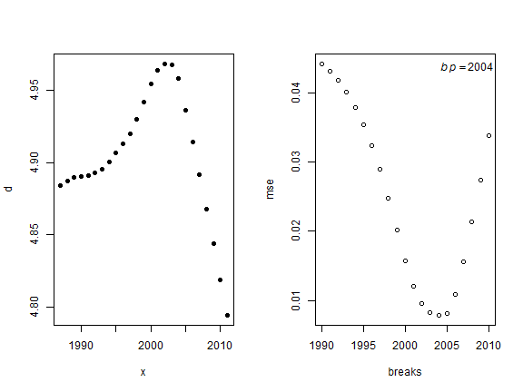
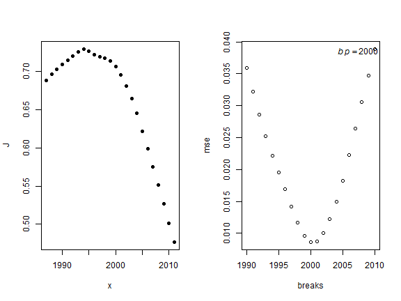
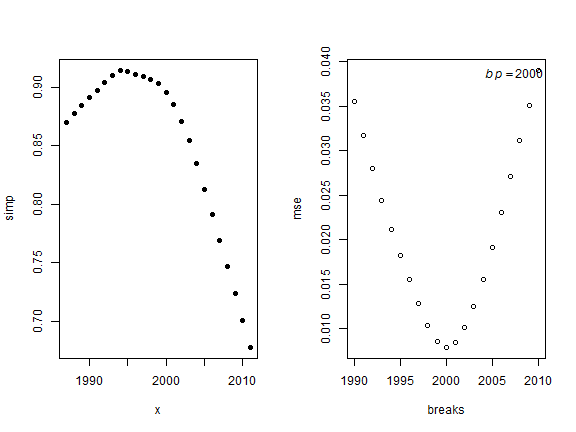
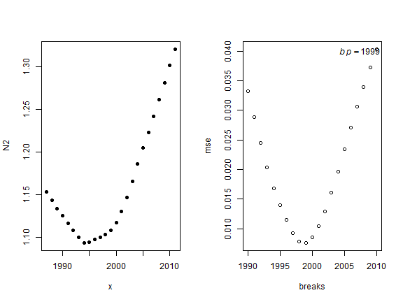

Diversity Metrics Analysis Script
=================================

**K.M.Purcell**  
[email](mailto:kevin@kevin-purcell.com)


## Data
### Fishery-independent

The datasets for this analysis derive from both fishery-dependent and fishery-indepedent data sets.  The fishery-independent data was derived from the SEAMAP survey data.  Data was downloaded on 2013-7-3, from the Gulf States Marine Fisheries online SEAMAP [access](http://seamap.gsmfc.org/) website.  We used several tables from their Access database with parameters including:


```r
names(starec.dat)
```

```
##  [1] "STATIONID"  "CRUISEID"   "VESSEL"     "CRUISE_NO"  "P_STA_NO"  
##  [6] "TIME_ZN"    "TIME_MIL"   "DEPTH_SSTA" "S_STA_NO"   "MO_DAY_YR" 
## [11] "TIME_EMIL"  "DEPTH_ESTA" "GEARS"      "TEMP_SSURF" "TEMP_BOT"  
## [16] "TEMP_SAIR"  "B_PRSSR"    "WIND_SPD"   "WIND_DIR"   "WAVE_HT"   
## [21] "SEA_COND"   "VESSEL_SPD" "FAUN_ZONE"  "STAT_ZONE"  "TOW_NO"    
## [26] "NET_NO"     "DECSLAT"    "DECSLON"    "DECELAT"    "DECELON"   
## [31] "START_DATE" "END_DATE"   "HAULVALUE"  "date"       "month"     
## [36] "YR"
```

```r
names(envrec.dat)
```

```
##  [1] "ENVRECID"   "CRUISEID"   "STATIONID"  "VESSEL"     "CRUISE_NO" 
##  [6] "P_STA_NO"   "CLD_TYPE"   "CLD_COVER"  "SECCHI_DSK" "WECOLOR"   
## [11] "STA_LOC"    "PRECIP"     "DEPTH_ESRF" "DEPTH_EMID" "DEPTH_EMAX"
## [16] "DEPTH_EWTR" "TEMPSURF"   "TEMPMID"    "TEMPMAX"    "SALSURF"   
## [21] "SALMID"     "SALMAX"     "CHLORSURF"  "CHLORMID"   "CHLORMAX"  
## [26] "OXYSURF"    "OXYMID"     "OXYMAX"     "TURBSURF"   "TURBMID"   
## [31] "TURBMAX"
```

```r
names(invrec.dat)
```

```
## [1] "STATIONID" "MIN_FISH"
```

```r
names(bgsrec.dat)
```

```
##  [1] "BGSID"      "CRUISEID"   "STATIONID"  "VESSEL"     "CRUISE_NO" 
##  [6] "P_STA_NO"   "CATEGORY"   "GENUS_BGS"  "SPEC_BGS"   "BGSCODE"   
## [11] "CNT"        "CNTEXP"     "SAMPLE_BGS" "SELECT_BGS" "BIO_BGS"   
## [16] "NODC_BGS"   "IS_SAMPLE"  "TAXONID"
```


### Fishery-dependent
Data on fishery-dependent parameters (fishery effort) was derived from data from the SHRCOM databases, which I obtained via [Jim Nance](email:james.m.nance@noaa.gov) from the [Galveston Laboratory](http://www.galvestonlab.sefsc.noaa.gov/) of the [Southeast Fishery Science Center (SEFC)](http://www.sefsc.noaa.gov/).  Data from the fishery was in a aggregated format which was provided directly from Jim with the parameters:


```r
names(shrcom.agg)
```

```
## [1] "yr"     "area"   "Season" "fz"     "pounds" "effort"
```


Additionally, I utilized information obtained online from [Fishbase](http://www.fishbase.org/) for species description information, namely habitat characteristics vital to catagorizing species into groups.


```r
names(specinfo.dat)
```

```
##  [1] "BIO_BGS"         "TAXONOMIC"       "common_name"    
##  [4] "Kingdom"         "Phylum"          "Class"          
##  [7] "Order"           "Family"          "Genus"          
## [10] "Species"         "Habitat.Biology" "Trophic_Level"  
## [13] "pel"             "dem"             "hab"
```


The environmental drivers under consideration in this project were fishing effort, data obtained via the ```shrcom.agg``` above and coastal hypoxia.  The hypoxia data was obtained from Rabalais (XXXX)?  I did not update these values to reflect the new study ```citep("10.1021/es400983g").  


```r
summary(hypox.area)
```

```
##        YR           areaNR          areaOB          volOB      
##  Min.   :1985   Min.   :   40   Min.   :  700   Min.   :  1.3  
##  1st Qu.:1992   1st Qu.: 9518   1st Qu.:10750   1st Qu.: 36.4  
##  Median :1998   Median :15440   Median :15600   Median : 62.6  
##  Mean   :1998   Mean   :13967   Mean   :14889   Mean   : 60.1  
##  3rd Qu.:2004   3rd Qu.:18130   3rd Qu.:20350   3rd Qu.: 73.4  
##  Max.   :2011   Max.   :22000   Max.   :23200   Max.   :137.5  
##                 NA's   :1
```


Data was then limited to the summer (``6`` - ``8``) and fall (``9`` - ``11``) months.  The nwGOM was divided into two regions Louisiana (``13``- ``17``) and Texas (``18``-``21``.  

A function ```divMetrics()``` was written to calcuate all the diversity metrics of interest for each of the region and seasonal data sets and returen a data frame of values.


```r
# load diversity function
source("C:\\Users\\Kevin.Purcell\\Documents\\GitHub\\EcosysMetricsGOM\\functions\\divMetrics.R")

# calculate diversity metrics
sum.la.agg <- divMetrics(sum.la.tab)
```

```
## Called from: divMetrics(sum.la.tab)
```

```r
sum.la.agg$mod <- "sum.la"

sum.tx.agg <- divMetrics(sum.tx.tab)
```

```
## Called from: divMetrics(sum.tx.tab)
```

```r
sum.tx.agg$mod <- "sum.tx"

fall.la.agg <- divMetrics(fall.la.tab)
```

```
## Called from: divMetrics(fall.la.tab)
```

```r
fall.la.agg$mod <- "fall.la"

fall.tx.agg <- divMetrics(fall.tx.tab)
```

```
## Called from: divMetrics(fall.tx.tab)
```

```r
fall.tx.agg$mod <- "fall.tx"

# source('C:\\Users\\Kevin.Purcell\\Desktop\\EcosysMetricsGOM\\Analysis\\ResultsFigures\\LaDivMetricsFig.R')
# source('C:\\Users\\Kevin.Purcell\\Desktop\\EcosysMetricsGOM\\Analysis\\ResultsFigures\\TxDivMetricsFig.R')
# source('C:\\Users\\Kevin.Purcell\\Desktop\\EcosysMetricsGOM\\Analysis\\ResultsFigures\\LaDivSmoothFig.R')
# source('C:\\Users\\Kevin.Purcell\\Desktop\\EcosysMetricsGOM\\Analysis\\ResultsFigures\\TxDivSmoothFig.R')
```

Data frames were created for each of the region/seasonal data sets.


```
## Error: object 'shrcom.agg2' not found
```


```
## Error: object 'x' not found
```

```
## Error: object 'shrcom.seg.mod' not found
```

```
## Error: object 'shrcom.seg.mod' not found
```

```
##  [1] "STATIONID"       "CRUISEID"        "VESSEL"         
##  [4] "CRUISE_NO"       "P_STA_NO"        "BIO_BGS"        
##  [7] "BGSID"           "CATEGORY"        "GENUS_BGS"      
## [10] "SPEC_BGS"        "BGSCODE"         "CNT"            
## [13] "CNTEXP"          "SAMPLE_BGS"      "SELECT_BGS"     
## [16] "NODC_BGS"        "IS_SAMPLE"       "TAXONID"        
## [19] "keep"            "TAXONOMIC"       "common_name"    
## [22] "Kingdom"         "Phylum"          "Class"          
## [25] "Order"           "Family"          "Genus"          
## [28] "Species"         "Habitat.Biology" "Trophic_Level"  
## [31] "pel"             "dem"             "hab"            
## [34] "MIN_FISH"        "TIME_ZN"         "TIME_MIL"       
## [37] "DEPTH_SSTA"      "S_STA_NO"        "MO_DAY_YR"      
## [40] "TIME_EMIL"       "DEPTH_ESTA"      "GEARS"          
## [43] "TEMP_SSURF"      "TEMP_BOT"        "TEMP_SAIR"      
## [46] "B_PRSSR"         "WIND_SPD"        "WIND_DIR"       
## [49] "WAVE_HT"         "SEA_COND"        "VESSEL_SPD"     
## [52] "FAUN_ZONE"       "STAT_ZONE"       "TOW_NO"         
## [55] "NET_NO"          "DECSLAT"         "DECSLON"        
## [58] "DECELAT"         "DECELON"         "START_DATE"     
## [61] "END_DATE"        "HAULVALUE"       "date"           
## [64] "month"           "YR"              "effort"         
## [67] "wt_per_min"      "c_per_min"       "ST_SELECT_BGS"  
## [70] "ST_CNTEXP"       "cpue"            "catch_cpue"     
## [73] "taxid"
```


```r
# load the break point function
source("C:\\Users\\Kevin.Purcell\\Documents\\GitHub\\EcosysMetricsGOM\\functions\\breakpts.R")
breakpt.fun(sum.la.agg, 1, 4)  # summer LA J
```

```
## [1] "Break point = 2005"
```


```
## 
## Call:
## lm(formula = y ~ x * (x < z) + x * (x > z))
## 
## Residuals:
##      Min       1Q   Median       3Q      Max 
## -0.10744 -0.03882  0.00751  0.03030  0.09609 
## 
## Coefficients: (1 not defined because of singularities)
##              Estimate Std. Error t value Pr(>|t|)
## (Intercept)  12.79459   30.55453    0.42     0.68
## x            -0.00609    0.01524   -0.40     0.69
## x < zTRUE   -16.49029   31.09632   -0.53     0.60
## x > zTRUE    -0.02757    0.08710   -0.32     0.75
## x:x < zTRUE   0.00831    0.01551    0.54     0.60
## x:x > zTRUE        NA         NA      NA       NA
## 
## Residual standard error: 0.0637 on 20 degrees of freedom
## Multiple R-squared:  0.681,	Adjusted R-squared:  0.617 
## F-statistic: 10.6 on 4 and 20 DF,  p-value: 8.65e-05
```

```r
breakpt.fun(sum.la.agg, 1, 5)  # summer LA d
```

```
## [1] "Break point = 2005"
```



```
## 
## Call:
## lm(formula = y ~ x * (x < z) + x * (x > z))
## 
## Residuals:
##     Min      1Q  Median      3Q     Max 
## -0.4298 -0.1652  0.0121  0.1448  0.3775 
## 
## Coefficients: (1 not defined because of singularities)
##             Estimate Std. Error t value Pr(>|t|)
## (Intercept)  70.8938   124.5009    0.57     0.58
## x            -0.0342     0.0621   -0.55     0.59
## x < zTRUE   -81.9512   126.7085   -0.65     0.53
## x > zTRUE    -0.0934     0.3549   -0.26     0.80
## x:x < zTRUE   0.0412     0.0632    0.65     0.52
## x:x > zTRUE       NA         NA      NA       NA
## 
## Residual standard error: 0.26 on 20 degrees of freedom
## Multiple R-squared:  0.688,	Adjusted R-squared:  0.626 
## F-statistic:   11 on 4 and 20 DF,  p-value: 6.8e-05
```

```r
breakpt.fun(sum.la.agg, 1, 6)
```

```
## [1] "Break point = 2005"
```



```
## 
## Call:
## lm(formula = y ~ x * (x < z) + x * (x > z))
## 
## Residuals:
##      Min       1Q   Median       3Q      Max 
## -0.12194 -0.02296  0.00043  0.03081  0.09987 
## 
## Coefficients: (1 not defined because of singularities)
##              Estimate Std. Error t value Pr(>|t|)
## (Intercept)  19.37752   28.03406    0.69     0.50
## x            -0.00928    0.01398   -0.66     0.51
## x < zTRUE   -22.83786   28.53116   -0.80     0.43
## x > zTRUE    -0.01124    0.07991   -0.14     0.89
## x:x < zTRUE   0.01147    0.01423    0.81     0.43
## x:x > zTRUE        NA         NA      NA       NA
## 
## Residual standard error: 0.0585 on 20 degrees of freedom
## Multiple R-squared:  0.71,	Adjusted R-squared:  0.652 
## F-statistic: 12.2 on 4 and 20 DF,  p-value: 3.45e-05
```

```r
breakpt.fun(sum.la.agg, 1, 7)
```

```
## [1] "Break point = 2005"
```


```
## 
## Call:
## lm(formula = y ~ x * (x < z) + x * (x > z))
## 
## Residuals:
##    Min     1Q Median     3Q    Max 
## -6.460 -3.300  0.177  1.721  7.623 
## 
## Coefficients: (1 not defined because of singularities)
##             Estimate Std. Error t value Pr(>|t|)
## (Intercept)  551.610   1900.370    0.29     0.77
## x             -0.270      0.948   -0.28     0.78
## x < zTRUE   -718.122   1934.068   -0.37     0.71
## x > zTRUE     -0.684      5.417   -0.13     0.90
## x:x < zTRUE    0.363      0.965    0.38     0.71
## x:x > zTRUE       NA         NA      NA       NA
## 
## Residual standard error: 3.96 on 20 degrees of freedom
## Multiple R-squared:  0.63,	Adjusted R-squared:  0.556 
## F-statistic: 8.51 on 4 and 20 DF,  p-value: 0.000352
```

```r
breakpt.fun(sum.la.agg, 1, 8)
```

```
## [1] "Break point = 2007"
```



```
## 
## Call:
## lm(formula = y ~ x * (x < z) + x * (x > z))
## 
## Residuals:
##     Min      1Q  Median      3Q     Max 
## -0.2300 -0.0437 -0.0129  0.0209  0.2485 
## 
## Coefficients: (1 not defined because of singularities)
##              Estimate Std. Error t value Pr(>|t|)  
## (Intercept)  165.8358    91.6550    1.81    0.085 .
## x             -0.0819     0.0457   -1.79    0.088 .
## x < zTRUE   -168.3691    91.9954   -1.83    0.082 .
## x > zTRUE      0.2650     0.1615    1.64    0.116  
## x:x < zTRUE    0.0838     0.0458    1.83    0.083 .
## x:x > zTRUE        NA         NA      NA       NA  
## ---
## Signif. codes:  0 '***' 0.001 '**' 0.01 '*' 0.05 '.' 0.1 ' ' 1
## 
## Residual standard error: 0.102 on 20 degrees of freedom
## Multiple R-squared:  0.699,	Adjusted R-squared:  0.639 
## F-statistic: 11.6 on 4 and 20 DF,  p-value: 4.81e-05
```

```r


breakpt.fun(biomass.dat, 1, 2)
```

```
## [1] "Break point = 2005"
```

```
## 
## Call:
## lm(formula = y ~ x * (x < z) + x * (x > z))
## 
## Residuals:
##      Min       1Q   Median       3Q      Max 
## -0.00687 -0.00282  0.00000  0.00116  0.00862 
## 
## Coefficients: (1 not defined because of singularities)
##              Estimate Std. Error t value Pr(>|t|)
## (Intercept)  0.352686   2.113016    0.17     0.87
## x           -0.000161   0.001054   -0.15     0.88
## x < zTRUE    2.384648   2.150484    1.11     0.28
## x > zTRUE    0.006983   0.006023    1.16     0.26
## x:x < zTRUE -0.001194   0.001073   -1.11     0.28
## x:x > zTRUE        NA         NA      NA       NA
## 
## Residual standard error: 0.00441 on 20 degrees of freedom
## Multiple R-squared:  0.712,	Adjusted R-squared:  0.654 
## F-statistic: 12.4 on 4 and 20 DF,  p-value: 3.18e-05
```

```
## Error: arguments imply differing number of rows: 0, 1
```


```r
breakpt.fun(abundance.dat, 1, 2)
```

```
## [1] "Break point = 1997"
```

```
## 
## Call:
## lm(formula = y ~ x * (x < z) + x * (x > z))
## 
## Residuals:
##     Min      1Q  Median      3Q     Max 
## -0.4656 -0.1095 -0.0251  0.1092  0.3865 
## 
## Coefficients: (1 not defined because of singularities)
##             Estimate Std. Error t value Pr(>|t|)   
## (Intercept) -48.1375    28.0486   -1.72   0.1016   
## x             0.0246     0.0140    1.76   0.0946 . 
## x < zTRUE   199.6125    54.2598    3.68   0.0015 **
## x > zTRUE    -0.0538     0.2433   -0.22   0.8272   
## x:x < zTRUE  -0.0998     0.0272   -3.67   0.0015 **
## x:x > zTRUE       NA         NA      NA       NA   
## ---
## Signif. codes:  0 '***' 0.001 '**' 0.01 '*' 0.05 '.' 0.1 ' ' 1
## 
## Residual standard error: 0.212 on 20 degrees of freedom
## Multiple R-squared:  0.729,	Adjusted R-squared:  0.674 
## F-statistic: 13.4 on 4 and 20 DF,  p-value: 1.8e-05
```

```
## Error: arguments imply differing number of rows: 0, 1
```



```r
breakpt.fun(shrcom.agg2, 1, 2)
```

```
## [1] "Break point = 2005"
```

```
## 
## Call:
## lm(formula = y ~ x * (x < z) + x * (x > z))
## 
## Residuals:
##    Min     1Q Median     3Q    Max 
## -30017  -9932   1612   9004  24173 
## 
## Coefficients: (1 not defined because of singularities)
##             Estimate Std. Error t value Pr(>|t|)
## (Intercept)  8930439    7084605    1.26     0.22
## x              -4403       3534   -1.25     0.23
## x < zTRUE   -2935449    7210229   -0.41     0.69
## x > zTRUE     -14914      20195   -0.74     0.47
## x:x < zTRUE     1499       3597    0.42     0.68
## x:x > zTRUE       NA         NA      NA       NA
## 
## Residual standard error: 14800 on 20 degrees of freedom
## Multiple R-squared:  0.95,	Adjusted R-squared:  0.94 
## F-statistic: 95.3 on 4 and 20 DF,  p-value: 9.95e-13
```

```
## Error: arguments imply differing number of rows: 0, 1
```


```r
breakpt.fun(hypox.area, 1, 2)
```

```
## [1] "Break point = 2000"
```

```
## 
## Call:
## lm(formula = y ~ x * (x < z) + x * (x > z))
## 
## Residuals:
##    Min     1Q Median     3Q    Max 
##  -8764  -1548    967   3501   5232 
## 
## Coefficients: (1 not defined because of singularities)
##              Estimate Std. Error t value Pr(>|t|)  
## (Intercept)  1.07e+05   8.58e+05    0.13    0.902  
## x           -5.15e+01   4.29e+02   -0.12    0.906  
## x < zTRUE   -1.89e+06   1.02e+06   -1.86    0.076 .
## x > zTRUE    1.25e+04   5.36e+03    2.33    0.030 *
## x:x < zTRUE  9.55e+02   5.09e+02    1.88    0.075 .
## x:x > zTRUE        NA         NA      NA       NA  
## ---
## Signif. codes:  0 '***' 0.001 '**' 0.01 '*' 0.05 '.' 0.1 ' ' 1
## 
## Residual standard error: 4500 on 21 degrees of freedom
##   (1 observation deleted due to missingness)
## Multiple R-squared:  0.492,	Adjusted R-squared:  0.395 
## F-statistic: 5.09 on 4 and 21 DF,  p-value: 0.00501
```

```
## Error: arguments imply differing number of rows: 0, 1
```


```r


# bind the model output tables
```


```r
# package methods

library(segmented)

lin.mod <- lm(y ~ x, data = sum.la.S)
segmented.mod <- segmented(lin.mod, seg.Z = ~x, psi = 1999)

plot(y ~ x, data = sum.la.S, pch = 16)
plot(segmented.mod$fitted.values ~ segmented.mod$coefficients)
```


## GAM Models

This might need to be a seperate analysis.  Also just found some citations to species time curves (``

```

Error in base::parse(text = code, srcfile = NULL) : 
  2:0: unexpected end of input
1: citep("10.1146/annurev.ecolsys.110308.120159"
   ^

```

``,``(<a href="http://dx.doi.org/10.1890/05-0067">Adler et al. 2005</a> )``,``(<a href="http://dx.doi.org/10.1046/j.1461-0248.2003.00497.x">Adler & Lauenroth, 2003</a> )``,``(<a href="http://dx.doi.org/10.1890/05-0067">Adler et al. 2005</a> )``) which could be an interesting way to determine the stability of the ecosystem and if we are seeing changes before and after large distrubtions in the ecosystem.  Perhaps I should revisit the Lorenz Curves (univariate:Gini index) from (``(<a href="http://dx.doi.org/10.1139/f03-076">Swain & Wade, 2003</a> )``) as a parameter but that uses catch, abundance, and distributional area so I am not sure that I can make the connections with the give resolution of data.  

Considering developing a set of GAM models to examine the relationship between hypoxia, effort and the specified diversity metrics.  

metric ~ s(year) + s(year, by=area.hypoxia) + s(year, by=fishing effort)


make a data set:


