<!-- rmarkdown v1 -->

Diversity Metrics Analysis Script
=================================

**K.M.Purcell**  
[email](mailto:kevin@kevin-purcell.com)


## Data
### Fishery-independent

The datasets for this analysis derive from both fishery-dependent and fishery-indepedent data sets.  The fishery-independent data was derived from the SEAMAP survey data.  Data was downloaded on 2013-7-3, from the Gulf States Marine Fisheries online SEAMAP [access](http://seamap.gsmfc.org/) website.  We used several tables from their Access database with parameters including:


```r
names(starec.dat)
```

```
##  [1] "STATIONID"  "CRUISEID"   "VESSEL"     "CRUISE_NO"  "P_STA_NO"  
##  [6] "TIME_ZN"    "TIME_MIL"   "DEPTH_SSTA" "S_STA_NO"   "MO_DAY_YR" 
## [11] "TIME_EMIL"  "DEPTH_ESTA" "GEARS"      "TEMP_SSURF" "TEMP_BOT"  
## [16] "TEMP_SAIR"  "B_PRSSR"    "WIND_SPD"   "WIND_DIR"   "WAVE_HT"   
## [21] "SEA_COND"   "VESSEL_SPD" "FAUN_ZONE"  "STAT_ZONE"  "TOW_NO"    
## [26] "NET_NO"     "DECSLAT"    "DECSLON"    "DECELAT"    "DECELON"   
## [31] "START_DATE" "END_DATE"   "HAULVALUE"  "date"       "month"     
## [36] "YR"
```

```r
names(envrec.dat)
```

```
##  [1] "ENVRECID"   "CRUISEID"   "STATIONID"  "VESSEL"     "CRUISE_NO" 
##  [6] "P_STA_NO"   "CLD_TYPE"   "CLD_COVER"  "SECCHI_DSK" "WECOLOR"   
## [11] "STA_LOC"    "PRECIP"     "DEPTH_ESRF" "DEPTH_EMID" "DEPTH_EMAX"
## [16] "DEPTH_EWTR" "TEMPSURF"   "TEMPMID"    "TEMPMAX"    "SALSURF"   
## [21] "SALMID"     "SALMAX"     "CHLORSURF"  "CHLORMID"   "CHLORMAX"  
## [26] "OXYSURF"    "OXYMID"     "OXYMAX"     "TURBSURF"   "TURBMID"   
## [31] "TURBMAX"
```

```r
names(invrec.dat)
```

```
## [1] "STATIONID" "MIN_FISH"
```

```r
names(bgsrec.dat)
```

```
##  [1] "BGSID"      "CRUISEID"   "STATIONID"  "VESSEL"     "CRUISE_NO" 
##  [6] "P_STA_NO"   "CATEGORY"   "GENUS_BGS"  "SPEC_BGS"   "BGSCODE"   
## [11] "CNT"        "CNTEXP"     "SAMPLE_BGS" "SELECT_BGS" "BIO_BGS"   
## [16] "NODC_BGS"   "IS_SAMPLE"  "TAXONID"
```

### Fishery-dependent
Data on fishery-dependent parameters (fishery effort) was derived from data from the SHRCOM databases, which I obtained via [Jim Nance](mailto:james.m.nance@noaa.gov) from the [Galveston Laboratory](http://www.galvestonlab.sefsc.noaa.gov/) of the [Southeast Fishery Science Center (SEFC)](http://www.sefsc.noaa.gov/).  Data from the fishery was in a aggregated format which was provided directly from Jim with the parameters:


```r
names(shrcom.agg)
```

```
## [1] "yr"     "area"   "Season" "fz"     "pounds" "effort"
```

Additionally, I utilized information obtained online from [Fishbase](http://www.fishbase.org/) for species description information, namely habitat characteristics vital to catagorizing species into groups.


```r
names(specinfo.dat)
```

```
##  [1] "BIO_BGS"         "TAXONOMIC"       "common_name"    
##  [4] "Kingdom"         "Phylum"          "Class"          
##  [7] "Order"           "Family"          "Genus"          
## [10] "Species"         "Habitat.Biology" "Trophic_Level"  
## [13] "pel"             "dem"             "hab"
```

The environmental drivers under consideration in this project were fishing effort, data obtained via the ```shrcom.agg``` above and coastal hypoxia.  The hypoxia data was obtained from Rabalais (XXXX)?  I did not update these values to reflect the new study ```citep("10.1021/es400983g").  


```r
summary(hypox.area)
```

```
##        YR           areaNR          areaOB          volOB      
##  Min.   :1985   Min.   :   40   Min.   :  700   Min.   :  1.3  
##  1st Qu.:1992   1st Qu.: 9518   1st Qu.:10750   1st Qu.: 36.4  
##  Median :1998   Median :15440   Median :15600   Median : 62.6  
##  Mean   :1998   Mean   :13967   Mean   :14889   Mean   : 60.1  
##  3rd Qu.:2004   3rd Qu.:18130   3rd Qu.:20350   3rd Qu.: 73.4  
##  Max.   :2011   Max.   :22000   Max.   :23200   Max.   :137.5  
##                 NA's   :1
```


Data was then limited to the summer (``6`` - ``8``) and fall (``9`` - ``11``) months.  The nwGOM was divided into two regions Louisiana (``13``- ``17``) and Texas (``18``-``21``.  

A function ```divMetrics()``` was written to calcuate all the diversity metrics of interest for each of the region and seasonal data sets and returen a data frame of values.


```r
# load diversity function
source("C:\\Users\\Kevin.Purcell\\Documents\\GitHub\\EcosysMetricsGOM\\functions\\divMetrics.R")

# calculate diversity metrics
sum.la.agg<-divMetrics(sum.la.tab)
sum.la.agg$mod<-"sum.la"

sum.tx.agg<-divMetrics(sum.tx.tab)
sum.tx.agg$mod<-"sum.tx"

fall.la.agg<-divMetrics(fall.la.tab)
fall.la.agg$mod<-"fall.la"

fall.tx.agg<-divMetrics(fall.tx.tab)
fall.tx.agg$mod<-"fall.tx"
```


Data frames were created for each of the region/seasonal data sets.


```
## Error: object 'sum.la.agg2' not found
```

```
## Error: object 'sum.la.dat2' not found
```

```
## Error: object 'sum.la.dat2' not found
```

```
## Error: object 'sum.la.dat2' not found
```

```
## Error: object 'sum.la.dat2' not found
```

```
## Error: object 'sum.la.dat2' not found
```

```
## Error: object 'sum.la.dat2' not found
```

```
## Error: object 'sum.la.dat2' not found
```

```
## Error: object 'sum.la.dat2' not found
```

```
## Error: plot.new has not been called yet
```

```
## Error: plot.new has not been called yet
```

```
## Error: plot.new has not been called yet
```

```
## Error: object 'fall.la.agg2' not found
```

```
## Error: object 'fall.la.dat2' not found
```

```
## Error: object 'fall.la.dat2' not found
```

```
## Error: object 'fall.la.dat2' not found
```

```
## Error: object 'fall.la.dat2' not found
```

```
## Error: object 'fall.la.dat2' not found
```

```
## Error: object 'fall.la.dat2' not found
```

```
## Error: object 'fall.la.dat2' not found
```

```
## Error: object 'fall.la.dat2' not found
```

```
## Error: plot.new has not been called yet
```

```
## Error: plot.new has not been called yet
```

```
## Error: plot.new has not been called yet
```

```
## Error: object 'sum.tx.agg2' not found
```

```
## Error: object 'sum.tx.dat2' not found
```

```
## Error: object 'sum.tx.dat2' not found
```

```
## Error: object 'sum.tx.dat2' not found
```

```
## Error: object 'sum.tx.dat2' not found
```

```
## Error: object 'sum.tx.dat2' not found
```

```
## Error: object 'sum.tx.dat2' not found
```

```
## Error: object 'sum.tx.dat2' not found
```

```
## Error: object 'sum.tx.dat2' not found
```

```
## Error: plot.new has not been called yet
```

```
## Error: plot.new has not been called yet
```

```
## Error: plot.new has not been called yet
```

```
## Error: object 'fall.tx.agg2' not found
```

```
## Error: object 'fall.tx.dat2' not found
```

```
## Error: object 'fall.tx.dat2' not found
```

```
## Error: object 'fall.tx.dat2' not found
```

```
## Error: object 'fall.tx.dat2' not found
```

```
## Error: object 'fall.tx.dat2' not found
```

```
## Error: object 'fall.tx.dat2' not found
```

```
## Error: object 'fall.tx.dat2' not found
```

```
## Error: object 'fall.tx.dat2' not found
```

```
## Error: plot.new has not been called yet
```

```
## Error: plot.new has not been called yet
```

```
## Error: plot.new has not been called yet
```


```
## [1] "Break point = 2002"
```


```
## 
## Call:
## lm(formula = y ~ x * (x < z) + x * (x > z))
## 
## Residuals:
##       Min        1Q    Median        3Q       Max 
## -7.08e-04 -1.32e-04 -1.71e-05  2.26e-04  8.73e-04 
## 
## Coefficients: (1 not defined because of singularities)
##              Estimate Std. Error t value Pr(>|t|)    
## (Intercept) -2.65e+00   9.76e-02  -27.18   <2e-16 ***
## x            1.34e-03   4.88e-05   27.46   <2e-16 ***
## x < zTRUE    5.23e+00   1.07e-01   48.65   <2e-16 ***
## x > zTRUE   -8.78e-04   4.67e-04   -1.88    0.075 .  
## x:x < zTRUE -2.61e-03   5.37e-05  -48.64   <2e-16 ***
## x:x > zTRUE        NA         NA      NA       NA    
## ---
## Signif. codes:  0 '***' 0.001 '**' 0.01 '*' 0.05 '.' 0.1 ' ' 1
## 
## Residual standard error: 0.000378 on 20 degrees of freedom
## Multiple R-squared:  0.996,	Adjusted R-squared:  0.995 
## F-statistic: 1.11e+03 on 4 and 20 DF,  p-value: <2e-16
```

```
## [1] "Break point = 2000"
```


```
## 
## Call:
## lm(formula = y ~ x * (x < z) + x * (x > z))
## 
## Residuals:
##      Min       1Q   Median       3Q      Max 
## -0.02213 -0.01253 -0.00294  0.00908  0.04079 
## 
## Coefficients: (1 not defined because of singularities)
##              Estimate Std. Error t value Pr(>|t|)    
## (Intercept) -51.85246    3.38994  -15.30  1.7e-12 ***
## x             0.02651    0.00169   15.64  1.1e-12 ***
## x < zTRUE   221.74317    4.28819   51.71  < 2e-16 ***
## x > zTRUE    -0.07214    0.02117   -3.41   0.0028 ** 
## x:x < zTRUE  -0.11092    0.00215  -51.66  < 2e-16 ***
## x:x > zTRUE        NA         NA      NA       NA    
## ---
## Signif. codes:  0 '***' 0.001 '**' 0.01 '*' 0.05 '.' 0.1 ' ' 1
## 
## Residual standard error: 0.0178 on 20 degrees of freedom
## Multiple R-squared:  0.997,	Adjusted R-squared:  0.997 
## F-statistic: 1.97e+03 on 4 and 20 DF,  p-value: <2e-16
```

```
## [1] "Break point = 2001"
```


```
## 
## Call:
## lm(formula = y ~ x * (x < z) + x * (x > z))
## 
## Residuals:
##    Min     1Q Median     3Q    Max 
##  -3730   -458      2    247   2392 
## 
## Coefficients: (1 not defined because of singularities)
##              Estimate Std. Error t value Pr(>|t|)    
## (Intercept)  27234290     281624   96.70   <2e-16 ***
## x              -13523        141  -96.08   <2e-16 ***
## x < zTRUE   -21200031     328417  -64.55   <2e-16 ***
## x > zTRUE        2572       1548    1.66     0.11    
## x:x < zTRUE     10600        164   64.52   <2e-16 ***
## x:x > zTRUE        NA         NA      NA       NA    
## ---
## Signif. codes:  0 '***' 0.001 '**' 0.01 '*' 0.05 '.' 0.1 ' ' 1
## 
## Residual standard error: 1280 on 20 degrees of freedom
## Multiple R-squared:     1,	Adjusted R-squared:     1 
## F-statistic: 1.22e+04 on 4 and 20 DF,  p-value: <2e-16
```

```
## [1] "Break point = 1996"
```


```
## 
## Call:
## lm(formula = y ~ x * (x < z) + x * (x > z))
## 
## Residuals:
##    Min     1Q Median     3Q    Max 
## -387.6  -89.8   -0.4   63.2  530.7 
## 
## Coefficients: (1 not defined because of singularities)
##              Estimate Std. Error t value Pr(>|t|)    
## (Intercept) -2.17e+05   2.86e+04   -7.57  2.0e-07 ***
## x            1.16e+02   1.43e+01    8.11  6.5e-08 ***
## x < zTRUE   -1.52e+06   5.40e+04  -28.08  < 2e-16 ***
## x > zTRUE   -8.23e+01   2.73e+02   -0.30     0.77    
## x:x < zTRUE  7.59e+02   2.71e+01   28.02  < 2e-16 ***
## x:x > zTRUE        NA         NA      NA       NA    
## ---
## Signif. codes:  0 '***' 0.001 '**' 0.01 '*' 0.05 '.' 0.1 ' ' 1
## 
## Residual standard error: 240 on 21 degrees of freedom
## Multiple R-squared:  0.996,	Adjusted R-squared:  0.995 
## F-statistic: 1.23e+03 on 4 and 21 DF,  p-value: <2e-16
```


```r
# load the break point function
source("C:\\Users\\Kevin.Purcell\\Documents\\GitHub\\EcosysMetricsGOM\\functions\\breakpts.R")
breakpt.fun(sum.la.S,1,2,1,1)
```

```
## [1] "Break point = 1997"
```


```
## 
## Call:
## lm(formula = y ~ x * (x < z) + x * (x > z))
## 
## Residuals:
##     Min      1Q  Median      3Q     Max 
## -0.2087 -0.0828  0.0000  0.0696  0.1965 
## 
## Coefficients: (1 not defined because of singularities)
##              Estimate Std. Error t value Pr(>|t|)    
## (Intercept) 138.80433   15.82700    8.77  2.7e-08 ***
## x            -0.03928    0.00793   -4.96  7.6e-05 ***
## x < zTRUE   468.78085   30.61719   15.31  1.6e-12 ***
## x > zTRUE     0.01130    0.13727    0.08     0.94    
## x:x < zTRUE  -0.23482    0.01536  -15.29  1.7e-12 ***
## x:x > zTRUE        NA         NA      NA       NA    
## ---
## Signif. codes:  0 '***' 0.001 '**' 0.01 '*' 0.05 '.' 0.1 ' ' 1
## 
## Residual standard error: 0.12 on 20 degrees of freedom
## Multiple R-squared:  0.987,	Adjusted R-squared:  0.985 
## F-statistic:  388 on 4 and 20 DF,  p-value: <2e-16
## 
## [1] 1997
```

```r
breakpt.fun(sum.la.d,1,2,2,1) 
```

```
## [1] "Break point = 2004"
```


```
## 
## Call:
## lm(formula = y ~ x * (x < z) + x * (x > z))
## 
## Residuals:
##       Min        1Q    Median        3Q       Max 
## -0.011051 -0.005065  0.000077  0.003440  0.013328 
## 
## Coefficients: (1 not defined because of singularities)
##              Estimate Std. Error t value Pr(>|t|)    
## (Intercept)  52.46578    3.03764    17.3  1.7e-13 ***
## x            -0.02371    0.00152   -15.6  1.1e-12 ***
## x < zTRUE   -59.16847    3.13924   -18.9  3.3e-14 ***
## x > zTRUE     0.00312    0.01050     0.3     0.77    
## x:x < zTRUE   0.02953    0.00157    18.9  3.3e-14 ***
## x:x > zTRUE        NA         NA      NA       NA    
## ---
## Signif. codes:  0 '***' 0.001 '**' 0.01 '*' 0.05 '.' 0.1 ' ' 1
## 
## Residual standard error: 0.00802 on 20 degrees of freedom
## Multiple R-squared:  0.972,	Adjusted R-squared:  0.967 
## F-statistic:  176 on 4 and 20 DF,  p-value: 2.73e-15
## 
## [1] 2004
```

```r
breakpt.fun(sum.la.J,1,2,3,1) 
```

```
## [1] "Break point = 2000"
```


```
## 
## Call:
## lm(formula = y ~ x * (x < z) + x * (x > z))
## 
## Residuals:
##      Min       1Q   Median       3Q      Max 
## -0.01356 -0.00387  0.00130  0.00475  0.01319 
## 
## Coefficients: (1 not defined because of singularities)
##              Estimate Std. Error t value Pr(>|t|)    
## (Intercept)  4.54e+01   1.49e+00   30.44   <2e-16 ***
## x           -2.23e-02   7.46e-04  -29.97   <2e-16 ***
## x < zTRUE   -4.89e+01   1.89e+00  -25.93   <2e-16 ***
## x > zTRUE    2.19e-02   9.31e-03    2.35    0.029 *  
## x:x < zTRUE  2.45e-02   9.45e-04   25.91   <2e-16 ***
## x:x > zTRUE        NA         NA      NA       NA    
## ---
## Signif. codes:  0 '***' 0.001 '**' 0.01 '*' 0.05 '.' 0.1 ' ' 1
## 
## Residual standard error: 0.00782 on 20 degrees of freedom
## Multiple R-squared:  0.992,	Adjusted R-squared:  0.99 
## F-statistic:  588 on 4 and 20 DF,  p-value: <2e-16
## 
## [1] 2000
```

```r
breakpt.fun(sum.la.shan,1,2,4,1) 
```

```
## [1] "Break point = 2000"
```

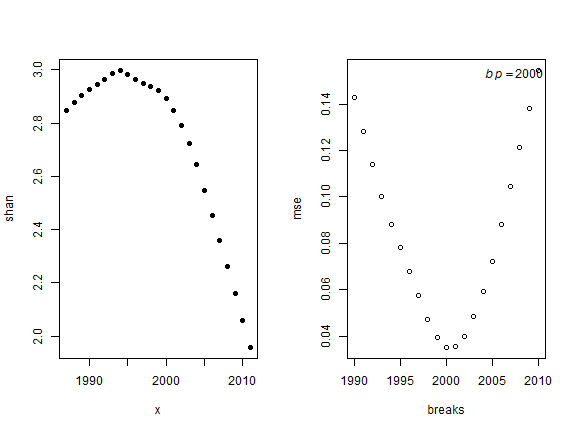

```
## 
## Call:
## lm(formula = y ~ x * (x < z) + x * (x > z))
## 
## Residuals:
##     Min      1Q  Median      3Q     Max 
## -0.0551 -0.0159  0.0052  0.0191  0.0540 
## 
## Coefficients: (1 not defined because of singularities)
##              Estimate Std. Error t value Pr(>|t|)    
## (Intercept)  1.85e+02   6.07e+00   30.47   <2e-16 ***
## x           -9.11e-02   3.04e-03  -30.00   <2e-16 ***
## x < zTRUE   -1.95e+02   7.68e+00  -25.36   <2e-16 ***
## x > zTRUE    8.99e-02   3.79e-02    2.37    0.028 *  
## x:x < zTRUE  9.74e-02   3.85e-03   25.34   <2e-16 ***
## x:x > zTRUE        NA         NA      NA       NA    
## ---
## Signif. codes:  0 '***' 0.001 '**' 0.01 '*' 0.05 '.' 0.1 ' ' 1
## 
## Residual standard error: 0.0318 on 20 degrees of freedom
## Multiple R-squared:  0.992,	Adjusted R-squared:  0.99 
## F-statistic:  605 on 4 and 20 DF,  p-value: <2e-16
## 
## [1] 2000
```

```r
breakpt.fun(sum.la.simp,1,2,5,1) 
```

```
## [1] "Break point = 2000"
```


```
## 
## Call:
## lm(formula = y ~ x * (x < z) + x * (x > z))
## 
## Residuals:
##       Min        1Q    Median        3Q       Max 
## -0.014546 -0.002844  0.000792  0.003493  0.012267 
## 
## Coefficients: (1 not defined because of singularities)
##              Estimate Std. Error t value Pr(>|t|)    
## (Intercept)  4.32e+01   1.38e+00   31.36   <2e-16 ***
## x           -2.12e-02   6.89e-04  -30.71   <2e-16 ***
## x < zTRUE   -4.84e+01   1.74e+00  -27.74   <2e-16 ***
## x > zTRUE    1.91e-02   8.61e-03    2.22    0.038 *  
## x:x < zTRUE  2.42e-02   8.73e-04   27.72   <2e-16 ***
## x:x > zTRUE        NA         NA      NA       NA    
## ---
## Signif. codes:  0 '***' 0.001 '**' 0.01 '*' 0.05 '.' 0.1 ' ' 1
## 
## Residual standard error: 0.00723 on 20 degrees of freedom
## Multiple R-squared:  0.992,	Adjusted R-squared:  0.99 
## F-statistic:  608 on 4 and 20 DF,  p-value: <2e-16
## 
## [1] 2000
```

```r
breakpt.fun(sum.la.N1,1,2,6,1) 
```

```
## [1] "Break point = 2000"
```


```
## 
## Call:
## lm(formula = y ~ x * (x < z) + x * (x > z))
## 
## Residuals:
##     Min      1Q  Median      3Q     Max 
## -0.9063 -0.2637  0.0726  0.2281  0.9303 
## 
## Coefficients: (1 not defined because of singularities)
##              Estimate Std. Error t value Pr(>|t|)    
## (Intercept)  2.27e+03   9.67e+01   23.52  4.8e-16 ***
## x           -1.13e+00   4.83e-02  -23.33  5.6e-16 ***
## x < zTRUE   -2.42e+03   1.22e+02  -19.75  1.4e-14 ***
## x > zTRUE    9.40e-01   6.04e-01    1.56     0.14    
## x:x < zTRUE  1.21e+00   6.12e-02   19.74  1.4e-14 ***
## x:x > zTRUE        NA         NA      NA       NA    
## ---
## Signif. codes:  0 '***' 0.001 '**' 0.01 '*' 0.05 '.' 0.1 ' ' 1
## 
## Residual standard error: 0.507 on 20 degrees of freedom
## Multiple R-squared:  0.988,	Adjusted R-squared:  0.985 
## F-statistic:  401 on 4 and 20 DF,  p-value: <2e-16
## 
## [1] 2000
```

```r
breakpt.fun(sum.la.N2,1,2,7,1) 
```

```
## [1] "Break point = 1999"
```


```
## 
## Call:
## lm(formula = y ~ x * (x < z) + x * (x > z))
## 
## Residuals:
##       Min        1Q    Median        3Q       Max 
## -0.013111 -0.002105 -0.000636  0.002151  0.016357 
## 
## Coefficients: (1 not defined because of singularities)
##              Estimate Std. Error t value Pr(>|t|)    
## (Intercept) -3.65e+01   1.21e+00  -30.12   <2e-16 ***
## x            1.88e-02   6.07e-04   31.03   <2e-16 ***
## x < zTRUE    4.76e+01   1.71e+00   27.80   <2e-16 ***
## x > zTRUE   -1.52e-02   8.52e-03   -1.79    0.089 .  
## x:x < zTRUE -2.38e-02   8.58e-04  -27.77   <2e-16 ***
## x:x > zTRUE        NA         NA      NA       NA    
## ---
## Signif. codes:  0 '***' 0.001 '**' 0.01 '*' 0.05 '.' 0.1 ' ' 1
## 
## Residual standard error: 0.00725 on 20 degrees of freedom
## Multiple R-squared:  0.991,	Adjusted R-squared:  0.989 
## F-statistic:  563 on 4 and 20 DF,  p-value: <2e-16
## 
## [1] 1999
```

```r
breakpt.fun(sum.tx.S,1,2,1,2)
```

```
## [1] "Break point = 1998"
```


```
## 
## Call:
## lm(formula = y ~ x * (x < z) + x * (x > z))
## 
## Residuals:
##      Min       1Q   Median       3Q      Max 
## -0.03809 -0.00884  0.00052  0.00843  0.03670 
## 
## Coefficients: (1 not defined because of singularities)
##              Estimate Std. Error t value Pr(>|t|)    
## (Intercept) 146.01373    2.78686   52.39   <2e-16 ***
## x            -0.04353    0.00139  -31.21   <2e-16 ***
## x < zTRUE   206.91379    4.53202   45.66   <2e-16 ***
## x > zTRUE    -0.02005    0.02183   -0.92     0.37    
## x:x < zTRUE  -0.10355    0.00227  -45.57   <2e-16 ***
## x:x > zTRUE        NA         NA      NA       NA    
## ---
## Signif. codes:  0 '***' 0.001 '**' 0.01 '*' 0.05 '.' 0.1 ' ' 1
## 
## Residual standard error: 0.0188 on 20 degrees of freedom
## Multiple R-squared:  0.999,	Adjusted R-squared:  0.999 
## F-statistic: 8.37e+03 on 4 and 20 DF,  p-value: <2e-16
## 
## [1] 1998
```

```r
breakpt.fun(sum.tx.d,1,2,2,2) 
```

```
## [1] "Break point = 2003"
```


```
## 
## Call:
## lm(formula = y ~ x * (x < z) + x * (x > z))
## 
## Residuals:
##       Min        1Q    Median        3Q       Max 
## -0.006154 -0.001201  0.000044  0.000807  0.006214 
## 
## Coefficients: (1 not defined because of singularities)
##              Estimate Std. Error t value Pr(>|t|)    
## (Intercept)  5.23e+01   8.86e-01    59.0   <2e-16 ***
## x           -2.38e-02   4.43e-04   -53.7   <2e-16 ***
## x < zTRUE   -4.35e+01   9.39e-01   -46.3   <2e-16 ***
## x > zTRUE    5.81e-03   3.64e-03     1.6     0.13    
## x:x < zTRUE  2.17e-02   4.69e-04    46.3   <2e-16 ***
## x:x > zTRUE        NA         NA      NA       NA    
## ---
## Signif. codes:  0 '***' 0.001 '**' 0.01 '*' 0.05 '.' 0.1 ' ' 1
## 
## Residual standard error: 0.00287 on 20 degrees of freedom
## Multiple R-squared:  0.999,	Adjusted R-squared:  0.998 
## F-statistic: 3.5e+03 on 4 and 20 DF,  p-value: <2e-16
## 
## [1] 2003
```

```r
breakpt.fun(sum.tx.J,1,2,3,2) 
```

```
## [1] "Break point = 2002"
```

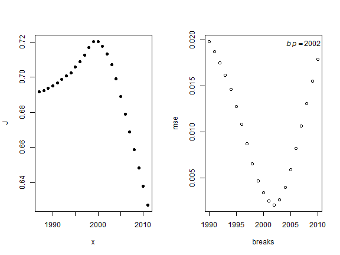

```
## 
## Call:
## lm(formula = y ~ x * (x < z) + x * (x > z))
## 
## Residuals:
##       Min        1Q    Median        3Q       Max 
## -0.003376 -0.001166  0.000160  0.000544  0.003982 
## 
## Coefficients: (1 not defined because of singularities)
##              Estimate Std. Error t value Pr(>|t|)    
## (Intercept)  2.09e+01   4.80e-01   43.62   <2e-16 ***
## x           -1.01e-02   2.40e-04  -42.14   <2e-16 ***
## x < zTRUE   -2.48e+01   5.28e-01  -46.92   <2e-16 ***
## x > zTRUE    5.62e-03   2.29e-03    2.45    0.024 *  
## x:x < zTRUE  1.24e-02   2.64e-04   46.91   <2e-16 ***
## x:x > zTRUE        NA         NA      NA       NA    
## ---
## Signif. codes:  0 '***' 0.001 '**' 0.01 '*' 0.05 '.' 0.1 ' ' 1
## 
## Residual standard error: 0.00186 on 20 degrees of freedom
## Multiple R-squared:  0.996,	Adjusted R-squared:  0.995 
## F-statistic: 1.13e+03 on 4 and 20 DF,  p-value: <2e-16
## 
## [1] 2002
```

```r
breakpt.fun(sum.tx.shan,1,2,4,2) 
```

```
## [1] "Break point = 2002"
```

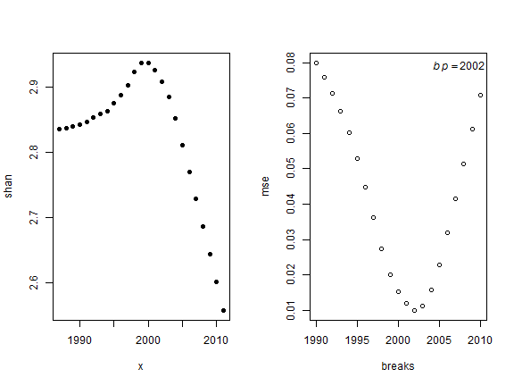

```
## 
## Call:
## lm(formula = y ~ x * (x < z) + x * (x > z))
## 
## Residuals:
##       Min        1Q    Median        3Q       Max 
## -0.014626 -0.006525  0.000575  0.002302  0.018463 
## 
## Coefficients: (1 not defined because of singularities)
##              Estimate Std. Error t value Pr(>|t|)    
## (Intercept)  85.68678    2.38451    35.9   <2e-16 ***
## x            -0.04135    0.00119   -34.7   <2e-16 ***
## x < zTRUE   -99.17417    2.62575   -37.8   <2e-16 ***
## x > zTRUE     0.02396    0.01140     2.1    0.049 *  
## x:x < zTRUE   0.04955    0.00131    37.8   <2e-16 ***
## x:x > zTRUE        NA         NA      NA       NA    
## ---
## Signif. codes:  0 '***' 0.001 '**' 0.01 '*' 0.05 '.' 0.1 ' ' 1
## 
## Residual standard error: 0.00923 on 20 degrees of freedom
## Multiple R-squared:  0.993,	Adjusted R-squared:  0.992 
## F-statistic:  758 on 4 and 20 DF,  p-value: <2e-16
## 
## [1] 2002
```

```r
breakpt.fun(sum.tx.simp,1,2,5,2) 
```

```
## [1] "Break point = 2002"
```


```
## 
## Call:
## lm(formula = y ~ x * (x < z) + x * (x > z))
## 
## Residuals:
##       Min        1Q    Median        3Q       Max 
## -0.003238 -0.000759  0.000113  0.000454  0.002791 
## 
## Coefficients: (1 not defined because of singularities)
##              Estimate Std. Error t value Pr(>|t|)    
## (Intercept)  1.48e+01   3.78e-01   39.11   <2e-16 ***
## x           -6.94e-03   1.89e-04  -36.73   <2e-16 ***
## x < zTRUE   -1.62e+01   4.17e-01  -38.92   <2e-16 ***
## x > zTRUE    4.15e-03   1.81e-03    2.29    0.033 *  
## x:x < zTRUE  8.10e-03   2.08e-04   38.91   <2e-16 ***
## x:x > zTRUE        NA         NA      NA       NA    
## ---
## Signif. codes:  0 '***' 0.001 '**' 0.01 '*' 0.05 '.' 0.1 ' ' 1
## 
## Residual standard error: 0.00146 on 20 degrees of freedom
## Multiple R-squared:  0.995,	Adjusted R-squared:  0.994 
## F-statistic:  946 on 4 and 20 DF,  p-value: <2e-16
## 
## [1] 2002
```

```r
breakpt.fun(sum.tx.N1,1,2,6,2) 
```

```
## [1] "Break point = 2001"
```


```
## 
## Call:
## lm(formula = y ~ x * (x < z) + x * (x > z))
## 
## Residuals:
##      Min       1Q   Median       3Q      Max 
## -0.24256 -0.07537 -0.00119  0.06315  0.14894 
## 
## Coefficients: (1 not defined because of singularities)
##              Estimate Std. Error t value Pr(>|t|)    
## (Intercept)  1.32e+03   2.27e+01   58.32  < 2e-16 ***
## x           -6.51e-01   1.13e-02  -57.50  < 2e-16 ***
## x < zTRUE   -1.86e+03   2.64e+01  -70.42  < 2e-16 ***
## x > zTRUE    5.85e-01   1.25e-01    4.69  0.00014 ***
## x:x < zTRUE  9.31e-01   1.32e-02   70.37  < 2e-16 ***
## x:x > zTRUE        NA         NA      NA       NA    
## ---
## Signif. codes:  0 '***' 0.001 '**' 0.01 '*' 0.05 '.' 0.1 ' ' 1
## 
## Residual standard error: 0.103 on 20 degrees of freedom
## Multiple R-squared:  0.997,	Adjusted R-squared:  0.996 
## F-statistic: 1.65e+03 on 4 and 20 DF,  p-value: <2e-16
## 
## [1] 2001
```

```r
breakpt.fun(sum.tx.N2,1,2,7,2) 
```

```
## [1] "Break point = 2002"
```

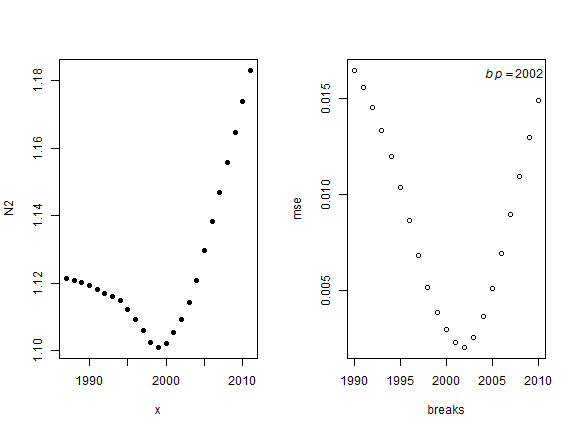

```
## 
## Call:
## lm(formula = y ~ x * (x < z) + x * (x > z))
## 
## Residuals:
##       Min        1Q    Median        3Q       Max 
## -0.003539 -0.000616 -0.000150  0.000978  0.004087 
## 
## Coefficients: (1 not defined because of singularities)
##              Estimate Std. Error t value Pr(>|t|)    
## (Intercept) -1.63e+01   4.83e-01  -33.85   <2e-16 ***
## x            8.72e-03   2.41e-04   36.15   <2e-16 ***
## x < zTRUE    2.06e+01   5.32e-01   38.77   <2e-16 ***
## x > zTRUE   -5.51e-03   2.31e-03   -2.38    0.027 *  
## x:x < zTRUE -1.03e-02   2.66e-04  -38.76   <2e-16 ***
## x:x > zTRUE        NA         NA      NA       NA    
## ---
## Signif. codes:  0 '***' 0.001 '**' 0.01 '*' 0.05 '.' 0.1 ' ' 1
## 
## Residual standard error: 0.00187 on 20 degrees of freedom
## Multiple R-squared:  0.994,	Adjusted R-squared:  0.993 
## F-statistic:  890 on 4 and 20 DF,  p-value: <2e-16
## 
## [1] 2002
```

```r
breakpt.fun(fall.la.S,1,2,1,3)
```

```
## [1] "Break point = 2001"
```

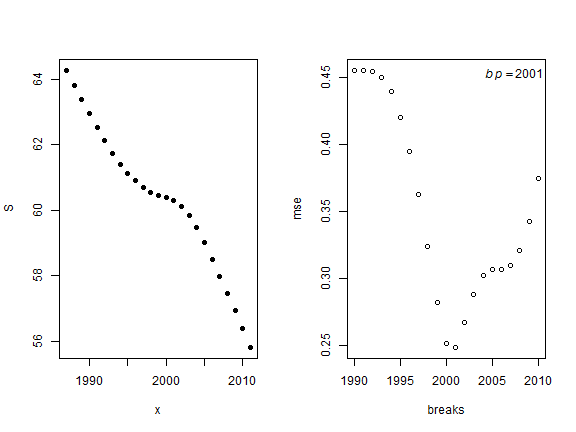

```
## 
## Call:
## lm(formula = y ~ x * (x < z) + x * (x > z))
## 
## Residuals:
##    Min     1Q Median     3Q    Max 
## -0.340 -0.140  0.000  0.109  0.514 
## 
## Coefficients: (1 not defined because of singularities)
##              Estimate Std. Error t value Pr(>|t|)    
## (Intercept) 1039.0838    51.4600   20.19  9.0e-15 ***
## x             -0.4891     0.0257  -19.02  2.8e-14 ***
## x < zTRUE   -362.9926    60.0104   -6.05  6.5e-06 ***
## x > zTRUE      0.5450     0.2829    1.93    0.068 .  
## x:x < zTRUE    0.1810     0.0300    6.03  6.8e-06 ***
## x:x > zTRUE        NA         NA      NA       NA    
## ---
## Signif. codes:  0 '***' 0.001 '**' 0.01 '*' 0.05 '.' 0.1 ' ' 1
## 
## Residual standard error: 0.234 on 20 degrees of freedom
## Multiple R-squared:  0.991,	Adjusted R-squared:  0.989 
## F-statistic:  561 on 4 and 20 DF,  p-value: <2e-16
## 
## [1] 2001
```

```r
breakpt.fun(fall.la.d,1,2,2,3) 
```

```
## [1] "Break point = 2000"
```


```
## 
## Call:
## lm(formula = y ~ x * (x < z) + x * (x > z))
## 
## Residuals:
##      Min       1Q   Median       3Q      Max 
## -0.04087 -0.01268  0.00229  0.01341  0.04198 
## 
## Coefficients: (1 not defined because of singularities)
##              Estimate Std. Error t value Pr(>|t|)    
## (Intercept)  8.84e+01   4.40e+00   20.07  1.0e-14 ***
## x           -4.17e-02   2.20e-03  -18.93  3.1e-14 ***
## x < zTRUE   -1.00e+02   5.57e+00  -18.02  7.8e-14 ***
## x > zTRUE    4.70e-02   2.75e-02    1.71      0.1    
## x:x < zTRUE  5.02e-02   2.79e-03   18.01  7.9e-14 ***
## x:x > zTRUE        NA         NA      NA       NA    
## ---
## Signif. codes:  0 '***' 0.001 '**' 0.01 '*' 0.05 '.' 0.1 ' ' 1
## 
## Residual standard error: 0.0231 on 20 degrees of freedom
## Multiple R-squared:  0.977,	Adjusted R-squared:  0.973 
## F-statistic:  214 on 4 and 20 DF,  p-value: 4.08e-16
## 
## [1] 2000
```

```r
breakpt.fun(fall.la.J,1,2,3,3) 
```

```
## [1] "Break point = 2004"
```


```
## 
## Call:
## lm(formula = y ~ x * (x < z) + x * (x > z))
## 
## Residuals:
##      Min       1Q   Median       3Q      Max 
## -0.01729 -0.00210  0.00000  0.00569  0.01277 
## 
## Coefficients: (1 not defined because of singularities)
##              Estimate Std. Error t value Pr(>|t|)    
## (Intercept)  56.06952    3.32428   16.87  2.7e-13 ***
## x            -0.02769    0.00166  -16.69  3.3e-13 ***
## x < zTRUE   -39.94514    3.43547  -11.63  2.4e-10 ***
## x > zTRUE     0.00285    0.01149    0.25     0.81    
## x:x < zTRUE   0.01994    0.00171   11.63  2.4e-10 ***
## x:x > zTRUE        NA         NA      NA       NA    
## ---
## Signif. codes:  0 '***' 0.001 '**' 0.01 '*' 0.05 '.' 0.1 ' ' 1
## 
## Residual standard error: 0.00878 on 20 degrees of freedom
## Multiple R-squared:  0.993,	Adjusted R-squared:  0.992 
## F-statistic:  714 on 4 and 20 DF,  p-value: <2e-16
## 
## [1] 2004
```

```r
breakpt.fun(fall.la.shan,1,2,4,3) 
```

```
## [1] "Break point = 2004"
```


```
## 
## Call:
## lm(formula = y ~ x * (x < z) + x * (x > z))
## 
## Residuals:
##      Min       1Q   Median       3Q      Max 
## -0.08249 -0.00873  0.00000  0.02532  0.07013 
## 
## Coefficients: (1 not defined because of singularities)
##              Estimate Std. Error t value Pr(>|t|)    
## (Intercept)  2.37e+02   1.66e+01   14.33  5.6e-12 ***
## x           -1.17e-01   8.26e-03  -14.19  6.7e-12 ***
## x < zTRUE   -1.60e+02   1.71e+01   -9.33  9.9e-09 ***
## x > zTRUE    1.22e-02   5.72e-02    0.21     0.83    
## x:x < zTRUE  7.97e-02   8.54e-03    9.33  1.0e-08 ***
## x:x > zTRUE        NA         NA      NA       NA    
## ---
## Signif. codes:  0 '***' 0.001 '**' 0.01 '*' 0.05 '.' 0.1 ' ' 1
## 
## Residual standard error: 0.0437 on 20 degrees of freedom
## Multiple R-squared:  0.991,	Adjusted R-squared:  0.989 
## F-statistic:  562 on 4 and 20 DF,  p-value: <2e-16
## 
## [1] 2004
```

```r
breakpt.fun(fall.la.simp,1,2,5,3) 
```

```
## [1] "Break point = 2002"
```

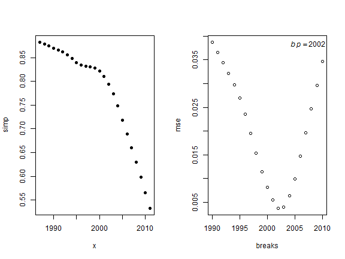

```
## 
## Call:
## lm(formula = y ~ x * (x < z) + x * (x > z))
## 
## Residuals:
##       Min        1Q    Median        3Q       Max 
## -0.004914 -0.001521  0.000531  0.002161  0.004027 
## 
## Coefficients: (1 not defined because of singularities)
##              Estimate Std. Error t value Pr(>|t|)    
## (Intercept)  6.14e+01   7.28e-01   84.31  < 2e-16 ***
## x           -3.03e-02   3.64e-04  -83.22  < 2e-16 ***
## x < zTRUE   -5.04e+01   8.01e-01  -62.95  < 2e-16 ***
## x > zTRUE    1.42e-02   3.48e-03    4.08  0.00059 ***
## x:x < zTRUE  2.52e-02   4.01e-04   62.92  < 2e-16 ***
## x:x > zTRUE        NA         NA      NA       NA    
## ---
## Signif. codes:  0 '***' 0.001 '**' 0.01 '*' 0.05 '.' 0.1 ' ' 1
## 
## Residual standard error: 0.00282 on 20 degrees of freedom
## Multiple R-squared:  0.999,	Adjusted R-squared:  0.999 
## F-statistic: 8.5e+03 on 4 and 20 DF,  p-value: <2e-16
## 
## [1] 2002
```

```r
breakpt.fun(fall.la.N1,1,2,6,3) 
```

```
## [1] "Break point = 2000"
```


```
## 
## Call:
## lm(formula = y ~ x * (x < z) + x * (x > z))
## 
## Residuals:
##    Min     1Q Median     3Q    Max 
## -0.763 -0.290  0.000  0.345  1.119 
## 
## Coefficients: (1 not defined because of singularities)
##              Estimate Std. Error t value Pr(>|t|)    
## (Intercept) 1908.4031    98.0560   19.46  1.8e-14 ***
## x             -0.9473     0.0490  -19.32  2.1e-14 ***
## x < zTRUE   -676.4883   124.0383   -5.45  2.4e-05 ***
## x > zTRUE      1.4057     0.6124    2.30    0.033 *  
## x:x < zTRUE    0.3375     0.0621    5.43  2.6e-05 ***
## x:x > zTRUE        NA         NA      NA       NA    
## ---
## Signif. codes:  0 '***' 0.001 '**' 0.01 '*' 0.05 '.' 0.1 ' ' 1
## 
## Residual standard error: 0.514 on 20 degrees of freedom
## Multiple R-squared:  0.989,	Adjusted R-squared:  0.986 
## F-statistic:  432 on 4 and 20 DF,  p-value: <2e-16
## 
## [1] 2000
```

```r
breakpt.fun(fall.la.N2,1,2,7,3) 
```

```
## [1] "Break point = 2002"
```

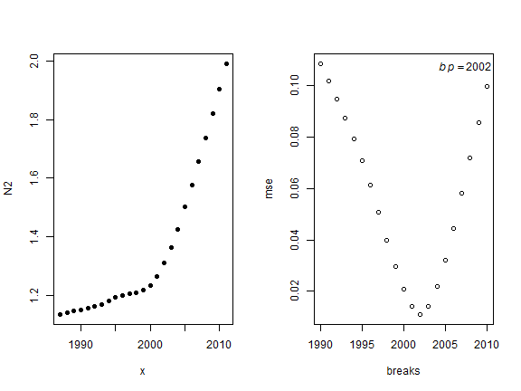

```
## 
## Call:
## lm(formula = y ~ x * (x < z) + x * (x > z))
## 
## Residuals:
##      Min       1Q   Median       3Q      Max 
## -0.00825 -0.00532 -0.00218  0.00267  0.02231 
## 
## Coefficients: (1 not defined because of singularities)
##              Estimate Std. Error t value Pr(>|t|)    
## (Intercept) -1.57e+02   2.20e+00   -71.2  < 2e-16 ***
## x            7.90e-02   1.10e-03    71.8  < 2e-16 ***
## x < zTRUE    1.42e+02   2.43e+00    58.4  < 2e-16 ***
## x > zTRUE   -4.11e-02   1.05e-02    -3.9  0.00089 ***
## x:x < zTRUE -7.08e-02   1.21e-03   -58.4  < 2e-16 ***
## x:x > zTRUE        NA         NA      NA       NA    
## ---
## Signif. codes:  0 '***' 0.001 '**' 0.01 '*' 0.05 '.' 0.1 ' ' 1
## 
## Residual standard error: 0.00853 on 20 degrees of freedom
## Multiple R-squared:  0.999,	Adjusted R-squared:  0.999 
## F-statistic: 5.8e+03 on 4 and 20 DF,  p-value: <2e-16
## 
## [1] 2002
```

```r
breakpt.fun(fall.tx.S,1,2,1,4)
```

```
## [1] "Break point = 1997"
```


```
## 
## Call:
## lm(formula = y ~ x * (x < z) + x * (x > z))
## 
## Residuals:
##     Min      1Q  Median      3Q     Max 
## -0.0951 -0.0355  0.0000  0.0120  0.2131 
## 
## Coefficients: (1 not defined because of singularities)
##              Estimate Std. Error t value Pr(>|t|)    
## (Intercept) 206.98817    9.96283   20.78  5.2e-15 ***
## x            -0.07386    0.00499  -14.81  3.1e-12 ***
## x < zTRUE   821.86405   19.27300   42.64  < 2e-16 ***
## x > zTRUE    -0.18429    0.08641   -2.13    0.046 *  
## x:x < zTRUE  -0.41178    0.00967  -42.58  < 2e-16 ***
## x:x > zTRUE        NA         NA      NA       NA    
## ---
## Signif. codes:  0 '***' 0.001 '**' 0.01 '*' 0.05 '.' 0.1 ' ' 1
## 
## Residual standard error: 0.0752 on 20 degrees of freedom
## Multiple R-squared:  0.998,	Adjusted R-squared:  0.998 
## F-statistic: 3.17e+03 on 4 and 20 DF,  p-value: <2e-16
## 
## [1] 1997
```

```r
breakpt.fun(fall.tx.d,1,2,2,4) 
```

```
## [1] "Break point = 2000"
```

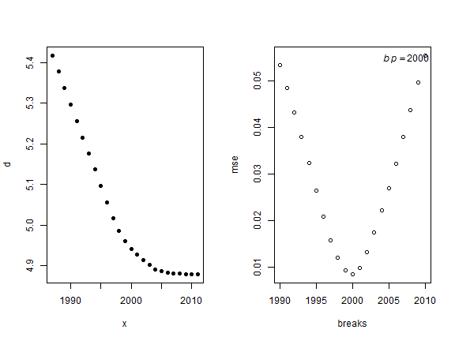

```
## 
## Call:
## lm(formula = y ~ x * (x < z) + x * (x > z))
## 
## Residuals:
##      Min       1Q   Median       3Q      Max 
## -0.00932 -0.00526 -0.00188  0.00398  0.01642 
## 
## Coefficients: (1 not defined because of singularities)
##              Estimate Std. Error t value Pr(>|t|)    
## (Intercept) 13.609056   1.390151    9.79  4.5e-09 ***
## x           -0.004334   0.000695   -6.23  4.3e-06 ***
## x < zTRUE   69.544968   1.758505   39.55  < 2e-16 ***
## x > zTRUE   -0.024759   0.008681   -2.85   0.0099 ** 
## x:x < zTRUE -0.034791   0.000880  -39.52  < 2e-16 ***
## x:x > zTRUE        NA         NA      NA       NA    
## ---
## Signif. codes:  0 '***' 0.001 '**' 0.01 '*' 0.05 '.' 0.1 ' ' 1
## 
## Residual standard error: 0.00729 on 20 degrees of freedom
## Multiple R-squared:  0.999,	Adjusted R-squared:  0.998 
## F-statistic: 3.7e+03 on 4 and 20 DF,  p-value: <2e-16
## 
## [1] 2000
```

```r
breakpt.fun(fall.tx.J,1,2,3,4) 
```

```
## [1] "Break point = 1998"
```


```
## 
## Call:
## lm(formula = y ~ x * (x < z) + x * (x > z))
## 
## Residuals:
##       Min        1Q    Median        3Q       Max 
## -0.006648 -0.001974  0.000177  0.002909  0.004718 
## 
## Coefficients: (1 not defined because of singularities)
##              Estimate Std. Error t value Pr(>|t|)    
## (Intercept)  1.44e+01   5.32e-01   27.06  < 2e-16 ***
## x           -6.84e-03   2.66e-04  -25.69  < 2e-16 ***
## x < zTRUE   -1.87e+01   8.65e-01  -21.57  2.5e-15 ***
## x > zTRUE    9.83e-03   4.17e-03    2.36    0.029 *  
## x:x < zTRUE  9.35e-03   4.34e-04   21.54  2.6e-15 ***
## x:x > zTRUE        NA         NA      NA       NA    
## ---
## Signif. codes:  0 '***' 0.001 '**' 0.01 '*' 0.05 '.' 0.1 ' ' 1
## 
## Residual standard error: 0.00359 on 20 degrees of freedom
## Multiple R-squared:  0.985,	Adjusted R-squared:  0.982 
## F-statistic:  324 on 4 and 20 DF,  p-value: <2e-16
## 
## [1] 1998
```

```r
breakpt.fun(fall.tx.shan,1,2,4,4) 
```

```
## [1] "Break point = 2000"
```

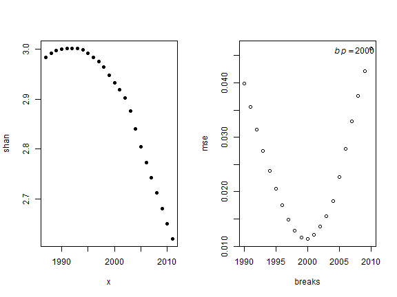

```
## 
## Call:
## lm(formula = y ~ x * (x < z) + x * (x > z))
## 
## Residuals:
##       Min        1Q    Median        3Q       Max 
## -0.023259 -0.001571 -0.000402  0.004831  0.013694 
## 
## Coefficients: (1 not defined because of singularities)
##              Estimate Std. Error t value Pr(>|t|)    
## (Intercept)  6.48e+01   1.97e+00    32.9  < 2e-16 ***
## x           -3.09e-02   9.85e-04   -31.4  < 2e-16 ***
## x < zTRUE   -5.62e+01   2.49e+00   -22.6  1.1e-15 ***
## x > zTRUE    2.83e-02   1.23e-02     2.3    0.032 *  
## x:x < zTRUE  2.81e-02   1.25e-03    22.5  1.1e-15 ***
## x:x > zTRUE        NA         NA      NA       NA    
## ---
## Signif. codes:  0 '***' 0.001 '**' 0.01 '*' 0.05 '.' 0.1 ' ' 1
## 
## Residual standard error: 0.0103 on 20 degrees of freedom
## Multiple R-squared:  0.994,	Adjusted R-squared:  0.993 
## F-statistic:  885 on 4 and 20 DF,  p-value: <2e-16
## 
## [1] 2000
```

```r
breakpt.fun(fall.tx.simp,1,2,5,4) 
```

```
## [1] "Break point = 1995"
```


```
## 
## Call:
## lm(formula = y ~ x * (x < z) + x * (x > z))
## 
## Residuals:
##      Min       1Q   Median       3Q      Max 
## -0.00419 -0.00153  0.00000  0.00122  0.00456 
## 
## Coefficients: (1 not defined because of singularities)
##              Estimate Std. Error t value Pr(>|t|)    
## (Intercept)  5.96e+00   2.59e-01   23.07  7.0e-16 ***
## x           -2.55e-03   1.30e-04  -19.67  1.5e-14 ***
## x < zTRUE   -1.83e+01   7.78e-01  -23.49  4.9e-16 ***
## x > zTRUE    6.09e-03   2.70e-03    2.26    0.035 *  
## x:x < zTRUE  9.17e-03   3.91e-04   23.46  5.0e-16 ***
## x:x > zTRUE        NA         NA      NA       NA    
## ---
## Signif. codes:  0 '***' 0.001 '**' 0.01 '*' 0.05 '.' 0.1 ' ' 1
## 
## Residual standard error: 0.00239 on 20 degrees of freedom
## Multiple R-squared:  0.975,	Adjusted R-squared:  0.97 
## F-statistic:  196 on 4 and 20 DF,  p-value: 9.53e-16
## 
## [1] 1995
```

```r
breakpt.fun(fall.tx.N1,1,2,6,4) 
```

```
## [1] "Break point = 1996"
```

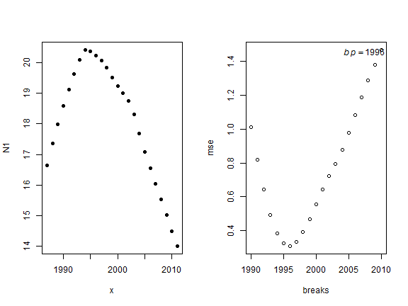

```
## 
## Call:
## lm(formula = y ~ x * (x < z) + x * (x > z))
## 
## Residuals:
##     Min      1Q  Median      3Q     Max 
## -0.5010 -0.1445  0.0234  0.2033  0.4440 
## 
## Coefficients: (1 not defined because of singularities)
##              Estimate Std. Error t value Pr(>|t|)    
## (Intercept)  9.23e+02   3.31e+01    27.9  < 2e-16 ***
## x           -4.52e-01   1.66e-02   -27.3  < 2e-16 ***
## x < zTRUE   -1.88e+03   7.85e+01   -24.0  3.3e-16 ***
## x > zTRUE    7.87e-01   3.15e-01     2.5    0.021 *  
## x:x < zTRUE  9.44e-01   3.94e-02    23.9  3.4e-16 ***
## x:x > zTRUE        NA         NA      NA       NA    
## ---
## Signif. codes:  0 '***' 0.001 '**' 0.01 '*' 0.05 '.' 0.1 ' ' 1
## 
## Residual standard error: 0.277 on 20 degrees of freedom
## Multiple R-squared:  0.983,	Adjusted R-squared:  0.98 
## F-statistic:  291 on 4 and 20 DF,  p-value: <2e-16
## 
## [1] 1996
```

```r
breakpt.fun(fall.tx.N2,1,2,7,4) 
```

```
## [1] "Break point = 1995"
```

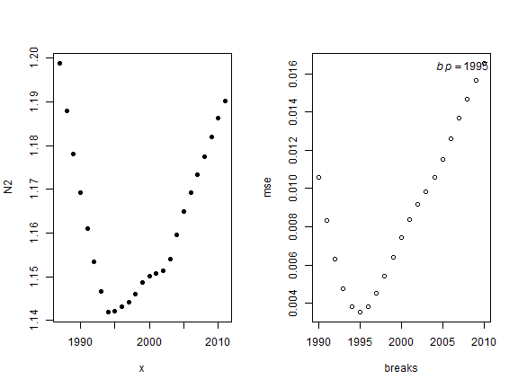

```
## 
## Call:
## lm(formula = y ~ x * (x < z) + x * (x > z))
## 
## Residuals:
##       Min        1Q    Median        3Q       Max 
## -0.006213 -0.001835 -0.000039  0.002110  0.005576 
## 
## Coefficients: (1 not defined because of singularities)
##              Estimate Std. Error t value Pr(>|t|)    
## (Intercept) -5.334009   0.355776   -15.0  2.4e-12 ***
## x            0.003246   0.000178    18.2  6.5e-14 ***
## x < zTRUE   22.796655   1.070767    21.3  3.3e-15 ***
## x > zTRUE   -0.007786   0.003713    -2.1    0.049 *  
## x:x < zTRUE -0.011433   0.000538   -21.3  3.4e-15 ***
## x:x > zTRUE        NA         NA      NA       NA    
## ---
## Signif. codes:  0 '***' 0.001 '**' 0.01 '*' 0.05 '.' 0.1 ' ' 1
## 
## Residual standard error: 0.00329 on 20 degrees of freedom
## Multiple R-squared:  0.97,	Adjusted R-squared:  0.964 
## F-statistic:  161 on 4 and 20 DF,  p-value: 6.39e-15
## 
## [1] 1995
```

```r
breakpt.tab<-rbind(sum.la_S, sum.la_d, sum.la_J, sum.la_shan, sum.la_simp, sum.la_N1, sum.la_N2,
                   sum.tx_S, sum.tx_d, sum.tx_J, sum.tx_shan, sum.tx_simp, sum.tx_N1, sum.tx_N2,
                   fall.la_S, fall.la_d, fall.la_J, fall.la_shan, fall.la_simp, fall.la_N1, fall.la_N2,
                   fall.tx_S, fall.tx_d, fall.tx_J, fall.tx_shan, fall.tx_simp, fall.tx_N1, fall.tx_N2)
#bind the model output tables
rm(sum.la_S, sum.la_d, sum.la_J, sum.la_shan, sum.la_simp, sum.la_N1, sum.la_N2,
                   sum.tx_S, sum.tx_d, sum.tx_J, sum.tx_shan, sum.tx_simp, sum.tx_N1, sum.tx_N2,
                   fall.la_S, fall.la_d, fall.la_J, fall.la_shan, fall.la_simp, fall.la_N1, fall.la_N2,
                   fall.tx_S, fall.tx_d, fall.tx_J, fall.tx_shan, fall.tx_simp, fall.tx_N1, fall.tx_N2)
```


```r
pandoc.table(breakpt.tab)
```


----------------------------------------
  mod    stat   alpha    p.Val    r.Sqr 
------- ------ ------- --------- -------
sum.la    S     1997   1.31e-19  0.9873 

sum.la    d     2004   0.0002485 0.9724 

sum.la    J     2000   1.341e-20 0.9916 

sum.la   shan   2000   7.232e-21 0.9918 

sum.la   simp   2000   1.671e-20 0.9918 

sum.la    N1    2000   3.197e-19 0.9877 

sum.la    N2    1999   4.741e-20 0.9912 

sum.tx    S     1998   2.187e-33 0.9994 

sum.tx    d     2003   1.004e-28 0.9986 

sum.tx    J     2002   3.282e-20 0.9956 

sum.tx   shan   2002   6.121e-19 0.9935 

sum.tx   simp   2002   8.883e-21 0.9947 

sum.tx    N1    2001   4.224e-17  0.997 

sum.tx    N2    2002   3.067e-20 0.9944 

fall.la   S     2001   6.789e-22 0.9912 

fall.la   d     2000   1.263e-15 0.9772 

fall.la   J     2004   1.212e-22  0.993 

fall.la  shan   2004   1.069e-21 0.9912 

fall.la  simp   2002   4.636e-33 0.9994 

fall.la   N1    2000   1.017e-20 0.9886 

fall.la   N2    2002   3.683e-31 0.9991 

fall.tx   S     1997   9.455e-29 0.9984 

fall.tx   d     2000   1.233e-29 0.9987 

fall.tx   J     1998   1.403e-17 0.9848 

fall.tx  shan   2000   3.028e-23 0.9944 

fall.tx  simp   1995   0.003069  0.9752 

fall.tx   N1    1996   2.83e-15  0.9831 

fall.tx   N2    1995   0.0005285  0.97  
----------------------------------------


 


