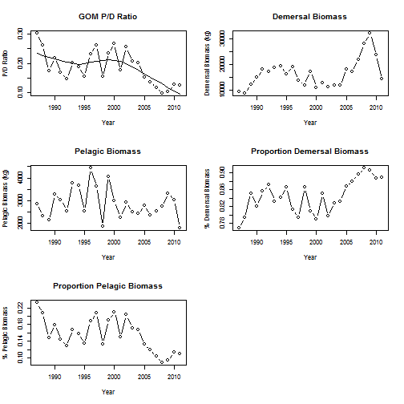
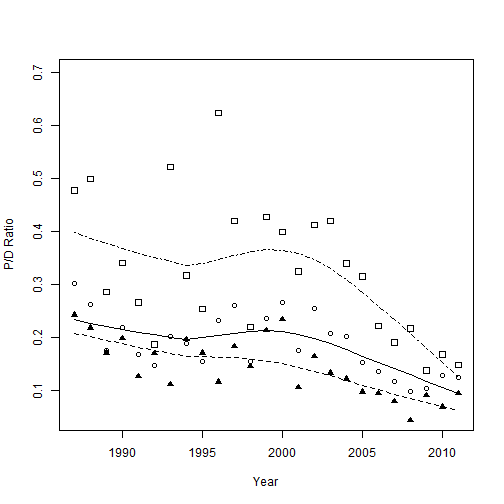

# Pelagic to Dermersal Biomass Analysis

**K.M. Purcell**  
Beaufort Laboratory  
National Marine Fisheries Service   
Beaufort, NC, USA  

[kevin@kevin.purcell.com](mailto:kevin@kevin-purcell.com)


This analysis script for calculating Pelagic to demersal ration from SEAMAP based on weight independent trawl survey.








```
## pdf 
##   2
```


