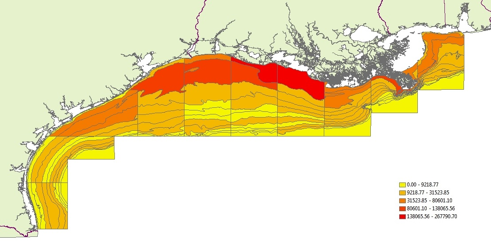
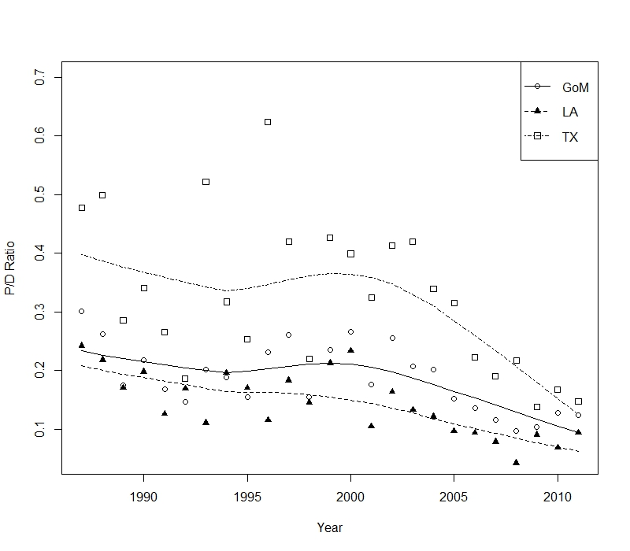
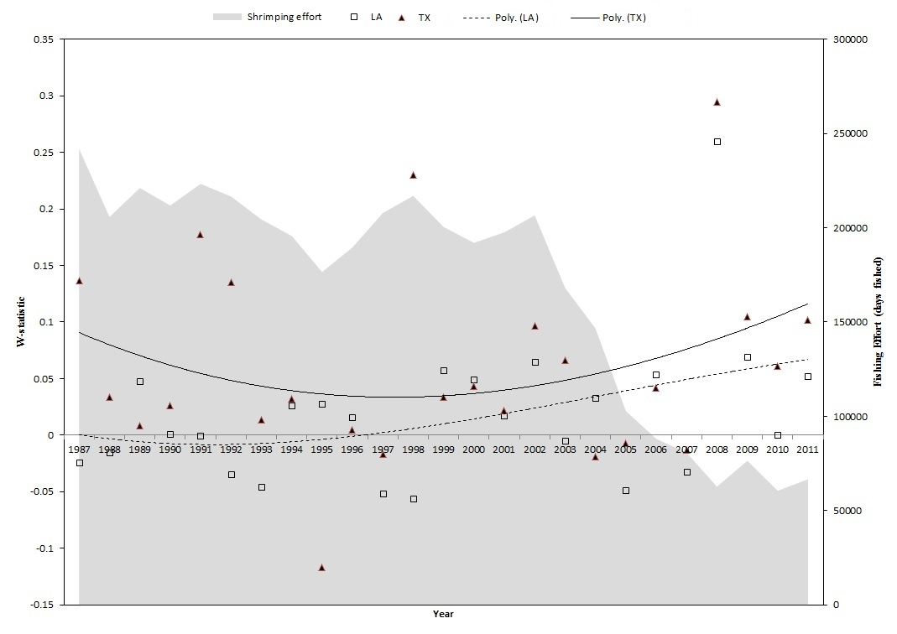

## Northwester Gulf of Mexico (Gulf)
- "Fertile fishery crescent" - *Gunter 1963*


## Gulf Hypoxia
- Largest seasonally occuring hypoxic zone in the western hemisphere


## Gulf Shrimp Fishery

- Bottom trawl fishery, primarily on the near shore shelf
- Targets Brown (*F. aztecus*) and White (*L. setiferus*) shrimp
- In 2011 landed ~208M pounds (68%) with revenues $387M




## Gulf Shrimp Fishery Profitability

- Since **2001** fishery profitability is faltering resulting in a dramatic reductions in fishing effort
- From **1980** to **2003** world export of shrimp products increased by 3.23B pounds, driving down prices  
- The ex-vessl price of shrimp dropped **40%** from **2000-2003** 
- Fuel costs increased between **20-30%** between **2000-2003** 
- Resulting in, sharp declines in economic performance & dramatic reductions in fishing effort


## Changes in Shrimping Effort

- Gulf shrimping effort peaked in **1988**
- larged reduction in fishery effort begining in **2000**

```{r, echo=FALSE, warning=FALSE, message=FALSE}
eff.dat<-read.csv("C:/Users/kevin.purcell/Documents/comm_analysis/offshore_6011.csv")
gom.eff <- aggregate(effort ~ yr, data=eff.dat, FUN=sum)
la.dat <- subset(eff.dat, eff.dat$area==3) #area 3 are Louisiana stat zones
tx.dat <- subset(eff.dat, eff.dat$area==4) #area 4 are Texas zones
la.eff <- aggregate(effort ~ yr, la.dat, FUN=sum)
tx.eff <- aggregate(effort ~ yr, tx.dat, FUN=sum)

plot(gom.eff$effort ~ gom.eff$yr,
          ylab="Fishing Effort (24 hours fished)",
          main="Regional Trends in Fishing Effort",
     ylim=c(5000,250000),
     type="p",
     col="lightgrey")
 lines(lowess(gom.eff$effort ~ gom.eff$yr, f=.2))
 lines(lowess(la.eff$effort~la.eff$yr, f=.2), col="blue")
 lines(lowess(tx.eff$effort~tx.eff$yr, f=.2), col="red")
 grid(col="black")
 abline(v=2000, col="black")
 legend("topright",col=c("black","blue","red"),lty=1,legend=c("GoM","Louisiana", "Texas"), bty="n")      

```


## Gulf Environmental Drivers

- Different temporal patterns for Hypoxia and Fishing

 


## Methods

### Questions 
1. What is the relationship between changes in fishery effort and community and populations dynamics.
2. What secondary role does eutrophicaion and hypoxia have to do with overall community change?

### Approaches
- Abundance Time series
- Diversity metrics Time series
- Breakpoint Analysis
- Pelagic:Demersal Time series
- Abundance-Biomass Curve (*W-statistic* time series)


## Study Data
### Fishery-Independent Data
- Southeast Area Monitoring and Assessment Program (**SEAMAP**) 
- 25 years (1987-2011)
- **60** species and **4** genus, representing ~ **90%** of total sampled biomass.
- We chose 20 taxa from 3 habitat groups: Demersal (**88%**), Pelagic (**95%**),  and Invertebrates (**97%**)


## Community Trends in Gulf of Mexico
 
 - Lowest Biomass & Abundance in **2000**
 
 
 

## Abundance  Matrix


- Bycatch Designations assigned based on *Scott-Denton et al. 2012*


## Diversity Time Series


## Piecewise Regression Analysis

### Drivers & Biomass
- Fishery effort was best modelled $\alpha$ = **2001**
- Area of hypoxia was best modelled with $\alpha$ = **1996**

### Diversity Metrics
- All break point models were significant and ranged from $\alpha$ = **1995** to **2004** 
- The earliest break point (1995) occurred on the Texas shelf during the Fall season
- All other region/season combinations break points were betwee 1999-2004
- 17 of the 18 indicators had break points on or after **2000** 

## Pelagic to Demersal Biomass



## Abundance-Biomass Curves



## Summary
- Strong temporal correlations between increased abundance of nekton in response to economically-driven changes in fishery effort
- Benthic disturbance indicators and

## Acknowledgements
- NOAA Center of Sponsored Coastal Ocean Research
- NOAA Fisheries Beaufort Laboratory
- B. Pelligrin, R. Hart, J. Rester, J. Primrose (*data access*)

