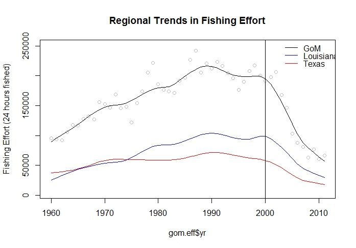

## Northwestern Gulf of Mexico (Gulf)
- "Fertile fishery crescent" - *Gunter 1963*

## Gulf Hypoxia
- Largest seasonally occurring hypoxic zone in the western hemisphere

## Gulf Shrimp Fishery

- Bottom trawl fishery, primarily on the near shore shelf
- Targets Brown (*F. aztecus*) and White (*L. setiferus*) shrimp
- In 2011 landed ~208M pounds (68%) with revenues $387M

## Changes in Shrimping Effort

- Gulf shrimping effort peaked in **1988**
- large reduction in fishery effort beginning in **2000**

## Environmental Drivers in Gulf of Mexico

- Different temporal patterns for Hypoxia and Fishing

 
 
 
## Methods

### Questions 
1. What is the relationship between changes in fishery effort and community and populations dynamics?
2. What secondary role does eutrophication and hypoxia have to do with overall community change?

### Approaches
- Abundance Time series
- Diversity metrics Time series
- Break-point Analysis
- Pelagic:Demersal Time series
- Abundance-Biomass Curve (*W-statistic* time series)

## Study Data
### Fishery-Independent Data
- Southeast Area Monitoring and Assessment Program (**SEAMAP**) 
- 25 years (1987-2011)
- **60** species and **4** genus, representing ~ **90%** of total sampled biomass.
- We chose 20 taxa from 3 habitat groups: Demersal (**88%**), Pelagic (**95%**),  and Invertebrates (**97%**)

### Fishery-Dependent
- Gulf Shrimp Statistics program
- Annual aerial extent of Hypoxia (*Obenour et al. 2013*)

## Nekton Community Trends in Gulf of Mexico
 
 - Lowest Biomass & Abundance in **2000**
 
 
 

## Taxon Abundance  Trends & Bycatch Relationship

- Bycatch designation based on *Scott-Denton et al. 2012*

## Diversity Time Series

 - Consistent change point circa 2000

## Piecewise Regression Analysis

### Environmental Drivers
- Fishery effort was best modeled $\alpha$ = **2001**
- Area of hypoxia was best modeled with $\alpha$ = **1996**

### Diversity Metrics
- All break point models ranged from $\alpha$ = **1995** - **2004** 
- 17 of the 18 indicators had break points on or after **2000** 

## Pelagic to Demersal Biomass

- **Negative** trend in P:D ratio

## Summary

### Conclusions
- Dramatic change in the nekton community occurred c. **2000**
- **Positive** trends in the abundance of fishery target & bycatch species
- Strong temporal correlations between increased **abundance** of nekton and decreases in **fishery effort**
- **Limited** indications that regional hypoxia is mitigating the positive effects of a release from harvest

### Future Directions
- Further study of ecosystem-based indicators
- Multivariate examination of species composition
- Examination of rare species occurrence

## Acknowledgements
- NOAA Center of Sponsored Coastal Ocean Research
- NOAA Fisheries Beaufort Laboratory
- B. Pelligrin, R. Hart, J. Rester, J. Primrose (*data access*)

## 

### Questions?

## Abundance-Biomass Curves

