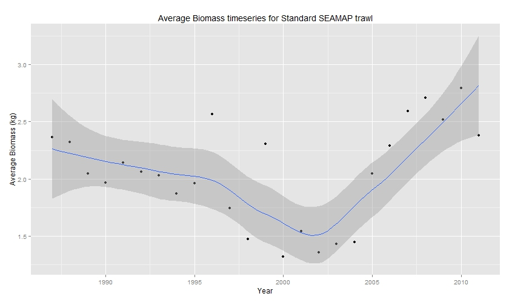
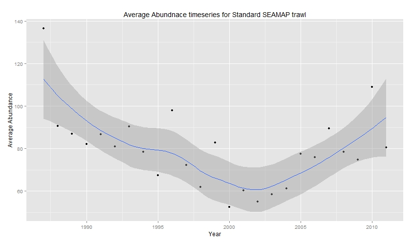
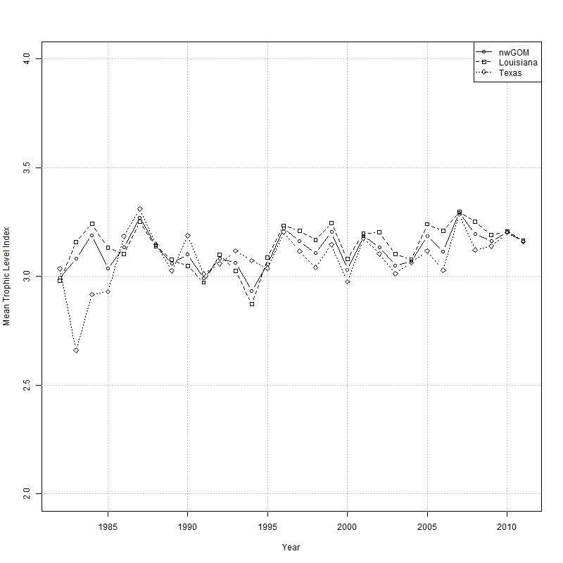

## Introduction
- Importance of the GoM to fisheries
- Major disruptions to the GoM ecosystem

## Hypoxia Distrbution

## Effort trends

## Community Trends in Gulf of Mexico
 
 - Lowest Biomass in **2000**
 
 
 

## Community Trends in Gulf of Mexico

- Lowest Abundance in **2000**

 

## Question and Approach
- What

## Methods
- data pooling
- 64 species choice
- Assining bycatch designations

## Abundance  Matrix

## Mean Trophic Level

## Abundance-Biomass Curves

## Breakpoint Analysis
Number of breaks before and after etc from text
