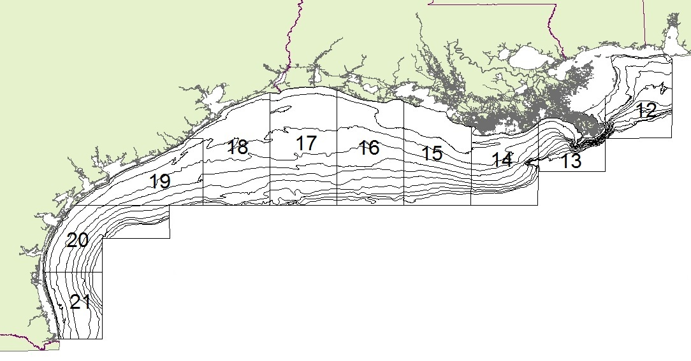

## Gulf of Mexico (Gulf) Shrimp Fishery




## Gulf Shrimp Trawl Fishery
- Bottom trawl fishery
- Occurs primarily on the near shore shelf
- Targets Brown (*F. aztecus*) & White (*L. setiferus*) shrimp.


## Gulf Shrimp Fishery Profitability

- Since **2001** fishery profitability is faltering driven by global trade and increased fuel prices. [@travis2004update].  
- From 1980 to 2003 world export of shrimp increased approximately 3.23 billion pounds, 
- meanwhile the price per pound of shrimp products dropped roughly 54% during the same period [@keithly2008southeast].  
- The ex-vessl, or dock side price, of shrimp in the Gulf dropped 40% from 2000-2003 [@keithly2008southeast; @jones2012big].  
- Fuel costs increased between 20-30% between 2000-2003, the economic performance of the Gulf shrimp fishery has been in a sharp decline for over a decade [@jones2012big] and is resulting in a dramatic reductions in fishing effort .  


## Hypoxia
- "Fertile fishery crescent" - *Gunter 1963*


## Effort trends

- Gulf Shrimp fishery undergoes


## Changes in Shrimping Effort

- Gulf shrimping effort peaked in **1988**
- larged reduction in fishery effort begining in **2000**

```{r, echo=FALSE, warning=FALSE, message=FALSE}
eff.dat<-read.csv("C:/Users/kevin.purcell/Documents/comm_analysis/offshore_6011.csv")
gom.eff <- aggregate(effort ~ yr, data=eff.dat, FUN=sum)
la.dat <- subset(eff.dat, eff.dat$area==3) #area 3 are Louisiana stat zones
tx.dat <- subset(eff.dat, eff.dat$area==4) #area 4 are Texas zones
la.eff <- aggregate(effort ~ yr, la.dat, FUN=sum)
tx.eff <- aggregate(effort ~ yr, tx.dat, FUN=sum)

plot(gom.eff$effort ~ gom.eff$yr,
          ylab="Fishing Effort (24 hours fished)",
          main="Regional Trends in Fishing Effort",
     ylim=c(5000,250000),
     type="p",
     col="white")
 lines(lowess(gom.eff$effort ~ gom.eff$yr, f=.2))
 lines(lowess(la.eff$effort~la.eff$yr, f=.2), col="blue")
 lines(lowess(tx.eff$effort~tx.eff$yr, f=.2), col="red")
 grid(col="black")
 abline(v=2000, col="black")
 legend("topright",col=c("black","blue","red"),lty=1,legend=c("GoM","Louisiana", "Texas"), bty="n")      

```


## Community Trends in Gulf of Mexico
 
 - Lowest Biomass & Abundance in **2000**
 
 
 

## Community Trends in Gulf of Mexico

- Different temporal patterns for Hypoxia and Fishing

 

## Questions and Approach
1. What, if any, ecosystem effects have resulted from massive changes in directed fishery effort?
2. Do changes in effort have disproportionate effects on certain biological domains?
3. Are there indications that changes in fishery efforts are mediating possible

- A number of ecosystem & community metrics
- Fishery-independent data on species occurance

This decline in effort which is not motivated by limitations in resource abundance but rather exogenous economic drivers provides us with an valuable opportunity to evaluate the community response to a release from predation while also allowing for an examination of the relative contribution of fishing effort and environmental perturbation on the demersal nekton community of a LME.  

## Objectives 

- to evaluate spatial and temporal variation in demersal nekton community of the northern Gulf of Mexico.  The nwGOM is a highly disturbed environment experiencing eutrophication, intense patterns of harvest over the last 30 years.  

- Compare spatial and temporal differences in bottom water hypoxia, in comparison to the rather uniform distribution shrimp fishery effort allows for the comparison of two region and two seasons providing a quai-experimental study design which allows for improved understanding of the mechanisms driving community dynamics in this LME???

## Approaches

- Abundance Time series
- Diversity Time series
- Pelatic:Demersal Time series
- Abundance-Biomass Curves
- Breakpoint Analysis

## Methods
- Southeast Area Monitoring and Assessment Program (**SEAMAP**)
- 64 species choice
- Assining bycatch designations

In the 31 years the SEAMAP survey has operated it has listed 2261 unique taxonomic entities representing 747 genus and 1341 species.  To more manageably examine the diversity and dynamics of this marine community we evaluated a list of 60 species and 4 genus which represent ~90% of the total sampled biomass over 25 years (1987-2011) of the SEAMAP survey.  To avoid the systematic size bias derived from a biomass metric our list was created by examining the cumulative biomass contributions of all 2261 entities divided into three habitat categories: pelagic, demersal and invertebrates.  From each of these three lists approximately 20 species were chosen from each representing 88% of demersal, 95% of pelagic and 97% of invertebrate sampled biomass.

## Abundance  Matrix


## Diversity Time Series


## Breakpoint Analysis
Number of breaks before and after etc from text

## Pelagic to Demersal Biomass


## Abundance-Biomass Curves


## Summary


